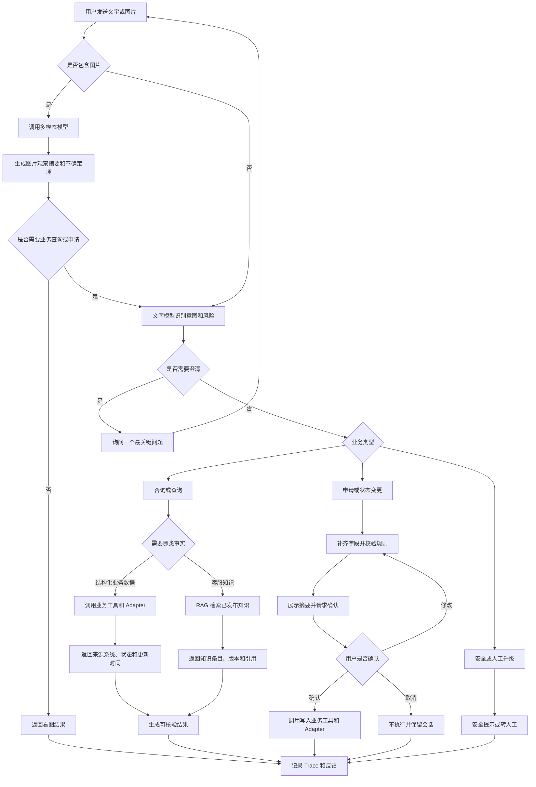
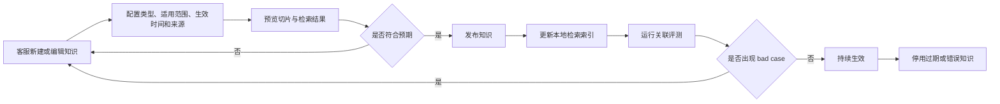

# 客服 Agent 实验室 PRD

**文档版本**：V1.5  
**文档状态**：消费者端保留三个售后入口，后台增加隐藏知识问答路由与四维意图结构  
**项目周期**：1～2 周  
**运行方式**：本地 Sandbox；生产接口契约由 Mock Adapter 实现  
**作品集定位**：AI 应用产品经理 / Agent 产品经理

## 一、背景与目标

### 1. 背景

灯具零售同时存在门店与电商渠道，售后问题主要集中在订单物流、收货退换和灯具故障。传统客服流程中，渠道规则与业务数据分散，用户经常需要重复描述问题；涉及退换申请、物流催办、故障建单或安全风险时，又不能只依靠大模型自由回答。

本项目构建一个灯具品牌的售后客服 Agent，并按正式项目设计数据来源、知识运营、业务工具、权限和追溯能力。消费者端顶级服务只保留订单物流、退换破损、故障报修三个模块；产品知识、配网、安装指导和部分消费者业务咨询由后台隐藏知识问答路由承接，不增加第四个快捷入口。加盟、供应商、营销活动等非消费者售后问题进入渠道指引或兜底。当前没有企业接口，因此本地 Sandbox 使用 Mock Adapter 和虚拟数据，但上层 Agent 与工具不直接依赖 Mock 文件。

目标生产架构中，产品主数据来自 PCMP，订单来自 OMS / 商城系统，仓储履约来自 WMS，物流轨迹来自 TMS / 承运商，售后工单来自 CRM / 客服系统；FAQ、产品说明、安装指导、渠道政策和售后知识由客服知识库维护并通过 RAG 使用。实际系统职责边界以后以企业架构为准。

项目重点展示以下能力：

- 通过意图识别将用户问题路由到正确业务流程。
- 通过工具读取事实、执行受控写操作并留下完整 Trace。
- 区分结构化业务数据与非结构化客服知识，分别通过业务工具和 RAG 获取。
- 让客服维护、发布和停用知识，并追溯回答使用的条目与版本。
- 根据场景分别调用文字模型和多模态模型。
- 对写操作执行 Human-in-the-loop，对安全、赔偿和责任问题转人工。
- 通过固定 Evals 与 bad case 回流验证迭代效果。

### 2. 产品定义

客服 Agent 实验室由五个核心页面组成：

1. **消费者聊天页**：发送文字或图片，完成咨询、查询、申请、售后和转人工。
2. **客服运营页**：查看异常订单、退换申请、工单、风险等级和对话依据。
3. **知识库管理页**：维护 FAQ、产品说明、渠道政策和售后知识，预览检索并完成发布或停用。
4. **Trace 页**：Mock 环境查看应用定义的完整 Prompt、模型输入输出、候选意图、规则证据、实体、模型路由、Adapter、目标来源系统、知识版本、工具调用、确认记录和错误。
5. **评测结果页**：运行固定案例并查看任务、事实、RAG、工具、安全和图片识别结果。

当前版本不接入真实企业系统、不处理真实支付、退款、赔偿和责任判定，也不部署在线服务。产品交互与接口契约按正式项目设计，后续通过替换 Adapter 接入真实系统。

### 3. 项目目标

| 目标 | 产品要求 |
| --- | --- |
| 形成售后闭环 | 走通订单物流与催办、退换申请、普通故障建单和安全升级代表性链路 |
| 提高回答可核验性 | 结构化事实来自业务工具，知识回答来自已发布知识，并记录来源、更新时间、条目与版本 |
| 建立可替换的数据架构 | 上层 Agent 只依赖统一业务接口，Mock 与真实系统通过 Adapter 切换 |
| 建立知识运营闭环 | 客服可维护知识，RAG 可检索和引用，无有效知识时不编造 |
| 控制业务风险 | 写操作先确认；安全、赔偿、判责、复杂投诉转人工 |
| 展示多模态能力 | P0 支持图片上传，根据场景调用多模态模型并处理不确定结果 |
| 支持持续迭代 | 固定评测集可重复运行，bad case 能定位到意图、模型、工具、规则或交互环节 |
| 支持公开展示 | GitHub 不包含真实接口、真实业务数据、个人信息或模型密钥 |

### 4. 非目标

- 不追求真实业务规模、真实并发或生产级 SLA。
- 不建设真实账号、支付、退款、赔偿、仓储、配送和上门调度能力。
- 不通过图片自动完成真伪鉴定、损坏判责、退换资格确认或赔偿决策。
- 不提供拆灯、接线、裸线检查等危险维修指导。
- 不建设生产级向量数据库、多 Agent、模型训练和复杂权限系统。
- P0 不开发 PCMP、OMS、WMS、TMS、CRM 的真实连接器，但必须定义目标接口契约和来源映射。
- P0 不实现完整知识审核流、批量导入、冲突检测和版本回滚。

### 5. P0 成功定义

- 本地一条命令可启动项目，模型无 Key 时仍可使用预设响应体验主流程。
- 纯文字、带图识别、查询工具、确认写操作、安全转人工均有可演示链路。
- 客服可新建、编辑、预览、发布和停用知识；RAG 只使用已发布且适用的内容。
- 页面可解释 Agent 为什么选择该意图、模型、业务工具或知识，以及结果来自哪个 Adapter、目标系统或知识版本。
- 替换业务 Adapter 时，意图、确认、安全规则和消费者页面不需要重写。
- 固定评测案例可以重复运行并定位失败环节。
- 所有公开数据为虚拟内容，两套模型 Key 仅保存在本机服务端环境变量中。

## 二、用户与场景

### 1. 目标用户

| 用户 | 主要任务 | P0 权限或入口 |
| --- | --- | --- |
| 消费者 | 查询订单物流、申请退换、排查故障、创建或查询工单 | 消费者聊天页 |
| 门店导购 / 电商客服 | 帮顾客确认产品、订单、渠道政策和服务入口 | 使用同一聊天页的演示身份 |
| 客服人员 / 主管 | 查看异常订单、退换申请、售后工单和高风险会话 | 客服运营页 |
| 知识运营 / 资深客服 | 维护 FAQ、说明书、渠道政策和售后知识，检查机器人召回效果 | 知识库管理页 |
| AI 产品经理 | 查看 Trace、运行评测、分析 bad case | Trace 页、评测结果页 |

P0 不做真实登录。订单与工单场景使用虚拟演示身份，并在读取敏感 Mock 数据前完成演示身份确认。

### 2. 核心场景

| 生命周期 | 用户示例 | Agent 目标 | 典型工具或模型 |
| --- | --- | --- | --- |
| 订单查询 | “我的灯发货了吗？” | 完成演示身份确认并通过订单接口返回状态 | 文字模型 + 订单工具 + Mock Adapter |
| 订单变更 | “地址填错了，帮我改一下。” | 校验订单状态，展示变更摘要，确认后提交模拟申请 | 文字模型 + 订单变更工具 |
| 物流异常 | “到站两天还没送。” | 查询轨迹与承运商联系方式；可电话联系，或确认后催办并同步人工客服 | 文字模型 + 物流工具 + 催办工具 |
| 收货破损 | “灯罩碎了，我上传照片了。” | 识别可见破损，生成可编辑退换表单，用户修改并确认后提交 | 多模态模型 + 文字模型 + 退换工具 |
| 铭牌识别 | “帮我看看这是什么型号。” | 读取图片中可见型号；模糊时说明不确定并要求补拍 | 多模态模型 |
| 产品知识 | “这款浴霸是单电机还是双电机？” | 后台命中隐藏知识问答路由；结构化参数优先查询产品工具，说明内容使用已发布知识 | 文字模型 + 产品工具 / RAG |
| 配网智控 | “为什么一直搜不到设备？” | 识别配网失败主题并检索对应指导；失败后可进入报修 | 文字模型 + RAG + 工单工具 |
| 故障售后 | “客厅灯一直闪。” | 检索已发布故障知识，提供安全步骤；无法解决时建单 | 文字模型 + RAG + 工单工具 |
| 安装服务 | “想预约师傅上门安装。” | 生成可编辑安装服务工单，用户确认后提交 | 文字模型 + 工单工具 |
| 安全风险 | “有烧焦味，还冒烟。” | 优先提示断电和停止使用，立即升级人工 | 文字模型 + 风险规则 + 转人工工具 |
| 工单查询 | “上次报修到哪一步了？” | 完成演示身份确认并返回 Mock 工单时间线 | 文字模型 + 工单查询工具 |

### 3. P0 意图框架

意图表用于定义业务路由节点，不穷举所有用户表达。客服问题库分类描述“用户在问什么知识”，Agent 路由描述“用户要完成什么任务”。内部结果使用 `module + intent + topic + action` 四个维度，避免把知识主题、用户目标和工具动作混成单一标签。产品经理维护进入条件、边界、few-shot、消歧规则和异常样例；知识运营维护主题标签及其适用范围。

| 路由族 | 主要子意图 | 进入条件 | 主要路由 | 边界 |
| --- | --- | --- | --- | --- |
| `logistics_query` | `status`、`contact`、`urge` | 查询订单物流、承运商、物流电话或要求催办 | 身份确认 → 查询 → 联系承运商或确认催办 | 催办属于写操作；不承诺送达时间或赔偿结果 |
| `return_exchange` | `intake`、`create`、`status` | 退货、换货、缺件、错发、到货破损或查询申请进度 | 补齐字段 → 资格预校验 → 可编辑草稿 → 确认 → 申请 / 查询 | 资格争议、判责和赔偿转人工 |
| `repair_support` | `troubleshoot`、`smart_setup`、`policy`、`installation_guide` | 故障、配网、售后政策或安装指导 | 安全分级 → 工具 / RAG → 排查、解释或建单 | 禁止带电拆解和危险操作 |
| `service_ticket` | `create`、`query` | 排查未解决、预约维修 / 安装或查询服务进度 | 可编辑草稿 → 确认建单，或身份确认 → 查询 | `serviceType` 区分维修与安装；不编造上门时间 |
| `knowledge_query` | `product`、`consumer_business` | 产品型号、功能、参数、认证、门店、验真和消费者渠道咨询 | 产品工具 / RAG → 回答 → 继续提供三个售后入口 | 后台隐藏路由，不增加首页入口，不执行写操作 |
| `human_escalation` | `safety`、`requested`、`dispute` | 安全信号、明确要求人工、赔偿判责或强投诉 | 安全提示 / 会话摘要 → 转人工 | 安全风险优先于全部普通意图 |
| `smalltalk` | `greeting` | 纯问候、感谢或结束语 | 简短回应 → 重新展示三个售后入口 | 不调用业务系统 |
| `clarification` | — | 可判断大致范围但缺少目标、对象或关键现象 | 只询问一个最关键问题 | 不猜测订单号、型号和购买渠道 |
| `other` | — | 无法归类，或加盟、供应商、营销活动等非消费者售后问题 | 边界说明或官方渠道指引 | 不强行匹配，不调用售后业务工具 |

### 4. 意图识别规则

- P0 采用“独立意图分类 + 路由内 Tool Calling”的混合模式。
- 每次需要进入业务流程的用户输入，先由文字模型根据意图表、必要会话上下文和图片观察摘要输出受约束的结构化结果，再进入对应业务路由；仅需读取图片可见信息时可由多模态模型直接回答。
- 图片是输入模态，不单独作为业务意图；图片观察摘要与用户文字共同参与意图判断。
- 同一句话包含多个任务时，优先级为：安全风险 → 明确转人工 → 写操作 → 查询 / 咨询，并在完成高优任务后继续处理剩余任务。
- 客服问题库主题作为 `topic`，用于 RAG 过滤、话术模板和评测切片；它不能覆盖 `intent` 或直接触发写操作。
- 产品知识、配网、安装指导和部分消费者业务咨询可命中隐藏的 `knowledge_query` 或 `repair_support`，但首页仍只展示三个售后入口。
- 上门安装预约进入 `service_ticket.create`，并设置 `serviceType=installation`；维修工单设置 `serviceType=repair`。
- 信息不足时返回 `needsClarification=true` 并生成一个最关键的澄清问题，不猜测订单号、型号或购买渠道。
- 模型输出不在允许集合内、结构无法解析或前后冲突时，统一进入 `clarification` 或 `other`，不直接执行工具。
- few-shot 首批覆盖：退货与换货区分、到货破损与使用中故障区分、订单与物流区分、规则咨询与实际申请区分、普通异响与烧焦味区分、明确转人工、混合意图和信息不足。

建议的内部意图结果字段：

```text
module
intent
topic
action
riskLevel
confidence
needsClarification
missingFields
remainingIntents
entities
observations
```

字段名称可在技术实现时调整，但必须支持业务模块、任务目标、知识主题、下一步动作、风险、缺失信息和混合任务处理。Mock Trace 记录应用可观测的完整 Prompt、模型输入输出、候选分类、规则证据和决策结果；平台级隐藏指令与模型私有思维链不属于应用可观测数据。

## 三、功能列表

### 1. P0：必须完成

| 编号 | 功能 | 核心要求 | 输出 |
| --- | --- | --- | --- |
| P0-01 | 消费者聊天 | 支持多轮文字、流式回复、会话上下文、停止生成与重新发送 | 可连续完成主流程 |
| P0-02 | 图片上传 | 支持选择、预览、删除、补充描述、处理中、失败和重试 | 图片消息与上传状态 |
| P0-03 | 双模型路由 | 纯文字走文字模型；看图走多模态模型；需业务查询或申请时再进入文字模型 | Trace 中可见模型路由 |
| P0-04 | 意图与风险识别 | 使用预定义意图框架、客服问题库主题、few-shot 和约束输出识别 `module`、`intent`、`topic`、`action`、剩余意图与风险 | 四维结构化意图结果 |
| P0-05 | 统一业务接口 | 为产品、订单、履约、物流、退换和工单定义统一契约、来源元数据与错误类型 | 可替换的业务接口 |
| P0-06 | Mock Adapter | 使用虚拟数据实现全部统一接口，模拟正式系统成功、空结果、超时和失败 | Sandbox 业务数据链路 |
| P0-07 | 客服知识库管理 | 新建、编辑、预览、发布和停用 FAQ / 文档知识，配置产品、渠道、地区、生效时间、来源、维护人和问题库主题标签 | 已发布知识集合 |
| P0-08 | RAG 检索与依据记录 | 只检索已发布且适用的知识，返回条目 ID、版本、引用和不确定状态；依据仅写入内部 Trace | 消费者无感、后台可追溯的知识回答 |
| P0-09 | 三入口与隐藏知识问答 | 首屏只展示订单物流、退换破损、故障报修三个入口；产品知识、配网、安装指导和部分消费者业务咨询可在后台路由回答；非消费者业务提供渠道指引 | 三入口菜单、知识回答与闲聊 / 兜底话术 |
| P0-10 | 订单与物流 | 演示身份确认后查询订单、履约与物流异常，展示承运商、运单号、客服电话，并支持电话联系或确认后一键催办 | 可核验状态、时间线、联系入口与催办编号 |
| P0-11 | 订单变更 | 校验状态，展示摘要，经确认后通过 Mock Adapter 创建变更申请 | 申请编号或明确失败 |
| P0-12 | 退换货 | 采集原因、商品状态、凭证 / 图片、联系人与取件地址，生成可编辑表单，用户修改并确认后创建申请 | 可编辑申请表、退换申请编号与下一步 |
| P0-13 | 故障、配网与安全排查 | RAG 只返回已发布且主题匹配的知识；普通故障和配网问题给出不拆机的安全排查步骤，高风险优先升级 | 排查步骤、报修入口或升级结果 |
| P0-14 | 售后与安装服务工单 | 补齐并允许编辑产品、渠道、服务类型、联系时段、问题、联系人和地址，确认后创建维修或安装工单 | 可编辑服务单、工单号与后续说明 |
| P0-15 | 工单查询 | 演示身份确认后通过 CRM 业务工具查询工单状态与事件时间线 | 可核验工单进度 |
| P0-16 | 用户确认组件 | 对订单变更、物流催办、退换和普通工单展示摘要；退换表单支持字段编辑，所有写操作支持确认、返回修改和取消 | 明确确认记录与最终提交快照 |
| P0-17 | 转人工 | 命中安全、赔偿、判责、强投诉、知识冲突或持续失败时生成摘要并升级 | 转人工状态与上下文摘要 |
| P0-18 | 运营台 | 查看异常订单、退换申请、售后工单、风险标签和来源会话 | 可筛选的 Sandbox 列表与详情 |
| P0-19 | Trace | Mock 环境记录并展示应用 System Prompt、模型消息、输出 Schema、few-shot ID、候选分类与置信度、规则证据、实体、原始 Mock 输出、最终决策、模型、Adapter、目标来源、知识版本、确认、耗时和工具脱敏入参 / 出参；消费者端不接收调试字段 | 单会话可展开的应用层全量调试链路 |
| P0-20 | 固定 Evals | 覆盖正常、RAG、无知识、知识冲突、工具、越权、图片、安全和注入案例 | 可重复运行的结果 |
| P0-21 | Sandbox 模式 | 消费者端保持正式体验；后台与 Trace 标识环境；无 Key 时提供模型 Mock | 生产感体验与透明说明 |
| P0-22 | 会话反馈 | 会话结束时记录是否解决及简单正 / 负反馈 | 端到端效果信号 |
| P0-23 | 复杂任务进度 | 订单 / 工单查询、图片识别、物流催办、退换申请和报修建单执行时，消费者端展示精简阶段、当前状态和总耗时，不展示内部参数或依据 | 用户等待期间持续获得可理解反馈 |

### 2. P1：增强作品集深度

- 客服主管看板：会话量、解决率、转人工率、失败类型和趋势。
- Prompt / 模型版本管理与评测对比。
- bad case 人工标注：意图、事实、检索、知识、工具、规则、图片或交互错误。
- 知识审核流、批量导入、冲突检测、版本回滚和知识效果分析。
- 数据源连接状态、更新延迟与 Adapter 异常监控。
- 登录与角色区分：顾客、客服主管、产品管理员。
- 更完整的敏感信息遮罩和输入安全检查。

### 3. P2：后续扩展

- 语音客服和真实渠道接入。
- 多 Agent 分工或更复杂的模型路由。
- PCMP、OMS、WMS、TMS、CRM 和客服系统的真实 Adapter 与增量同步。
- 生产级向量数据库与正式知识权限体系。
- 成本、延迟和质量的多模型对比。

## 四、交互流程

### 1. 全局主流程



### 2. 图片场景流程

1. 用户点击图片按钮，选择本地图片。
2. 前端完成格式、大小和张数校验；具体限制待多模态 API Smoke Test 后确定。
3. 显示缩略图，用户可删除、重新选择并补充文字描述。
4. 发送后调用多模态模型，返回可见事实、候选字段、不确定项和安全信号。
5. 仅需看图回答时，由多模态结果直接生成回复，不额外调用文字模型。
6. 需要查询订单、匹配产品、申请退换或创建工单时，将图片观察摘要交给文字模型继续编排。
7. 型号、订单号、购买时间、损坏现象等关键字段必须向用户回显；不确定信息不得自动写入申请。
8. 图片识别失败时保留用户文字，提供重新上传、补充文字或转人工选项。

### 3. 写操作确认流程

确认卡片必须展示：

- 操作类型。
- 目标订单、商品或工单。
- 即将提交的关键字段。
- 图片识别字段及其“不确定”标记。
- 目标业务系统、当前 Adapter 与 Sandbox 环境说明。
- “确认提交”“返回修改”“取消”三个操作。

用户确认后才生成 `confirmationId` 并调用写工具。工具失败时确认记录仍保留，但页面不得显示成功编号。

### 4. 知识维护与发布流程



P0 允许知识运营直接发布，以缩短演示链路；目标正式流程保留审核人字段，P1 再实现提交审核、驳回和版本回滚。

### 5. 五个页面的关键交互

| 页面 | 关键内容 | 必须可操作 |
| --- | --- | --- |
| 消费者聊天页 | 消息流、快捷案例、图片附件、确认卡片、复杂任务进度、会话反馈 | 发消息、传图、确认 / 修改 / 取消、重试、重置会话；长任务可展开精简进度，不展示回答依据或内部参数 |
| 客服运营页 | 异常订单、退换申请、工单、人工升级、风险标签 | 筛选、查看详情、回到来源会话 |
| 知识库管理页 | FAQ / 文档列表、适用范围、状态、版本、切片与检索预览 | 新建、编辑、预览、发布、停用、测试召回 |
| Trace 页 | 意图、风险、决策摘要、模型、Adapter、目标来源、图片观察、知识版本、工具、确认、耗时和错误 | 按会话筛选，展开阶段，查看接口名、方法、路径、脱敏入参、返回摘要、状态码与来源 |
| 评测结果页 | 案例列表、通过状态、失败环节、知识 / Prompt / 模型版本 | 运行全部 / 单条案例、查看 RAG 与工具失败详情 |

## 五、规则与边界

### 1. 模型路由规则

| 输入 | 模型路径 | 规则 |
| --- | --- | --- |
| 纯文字 | 文字模型 | 完成意图识别、业务推理、Tool Calling 和最终回答 |
| 图片且仅需读取可见信息 | 多模态模型 | 不为展示架构而重复调用文字模型 |
| 图片且需要业务查询或申请 | 多模态模型 → 文字模型 | 只传结构化观察摘要，不把不确定项当作事实 |
| 后续纯文字追问 | 文字模型 | 读取会话中的图片观察摘要；用户要求重看时才再次传图 |
| 任一模型不可用 | Mock 响应或明确失败 | 不伪装成 Live 调用成功 |

### 2. 结构化数据与 RAG 分流规则

| 信息类型 | 获取方式 | 规则 |
| --- | --- | --- |
| 产品型号、SKU、规格、上下架状态 | PCMP 契约对应的产品工具 | 结构化主数据优先，不从 RAG 猜测 |
| 订单、履约、物流、退换、工单 | OMS / WMS / TMS / CRM 契约对应的业务工具 | 实时事实只走工具，不写入向量索引 |
| FAQ、说明书、安装指导、渠道政策、售后知识 | RAG | 只检索已发布、在有效期内且适用范围匹配的知识 |
| 订单变更、物流催办、退换申请、创建工单 | 结构化写工具 | RAG 无写权限，必须经过用户确认 |

- 数据冲突时优先级为：业务系统实时数据 ＞ 已发布知识库 ＞ 模型通用知识。
- 产品结构化参数以 PCMP 契约结果为准；说明书只用于解释，不覆盖主数据。
- 未召回有效知识时明确无法确认并澄清；多条知识冲突、过期或不适用时转人工并记录 bad case。
- 知识回答必须在内部 Trace 保留条目 ID、版本、引用片段和最终是否采用；消费者端不提供依据查看入口。

### 3. 工具权限规则

| 处理等级 | 操作 | 执行规则 |
| --- | --- | --- |
| 自动执行 | 产品、订单、履约、物流、工单查询；RAG 检索 | 满足演示身份、必要参数或知识适用条件后可执行 |
| 用户确认 | 订单变更、取消、物流催办、退换申请、普通售后工单 | 展示摘要并取得明确确认后执行；物流催办同步 TMS / 承运商和 CRM 人工客服 |
| 自动升级 | 触电、冒烟、烧焦味、明显过热等安全风险 | 先给安全提示，再创建高优人工升级 |
| 必须转人工 | 赔偿、退款金额、退换资格争议、责任归属、保修例外、多次维修未解决、强烈投诉 | Agent 只采集信息和生成摘要 |
| 禁止 | 泄露他人订单、绕过确认、虚假承诺、危险维修指导、泄露 Prompt / Key | 拒绝并记录风险事件 |

### 4. 知识生命周期规则

- P0 知识状态为草稿、已发布、已停用；只有已发布知识进入 RAG 索引。
- 知识必须记录类型、适用产品 / 品类、渠道、地区、生效与失效时间、来源、维护人和版本。
- 发布前必须支持检索预览，至少验证一个目标问题和一个不应命中的问题。
- 修改已发布知识后形成新版本标识；P0 可保留历史元数据，P1 实现完整版本回滚。
- 停用后新会话不得继续召回；已有 Trace 仍保留当时使用的版本信息。
- 高风险安全知识必须有明确来源；没有有效知识时直接转人工，不由模型生成维修步骤。

### 5. 图片规则

- 允许上传商品、包装破损、灯具铭牌、购买凭证和故障照片。
- 图片观察结果只描述“看到了什么”和“无法确认什么”，不得推断图片外事实。
- 图片不能作为身份验证的唯一依据，也不能单独决定退换资格、损坏责任或赔偿。
- 图片仅用于当前本地会话；默认不长期保存，不写入 GitHub。
- Trace 只保存图片元数据、调用状态和结构化观察摘要，不保存 Base64 和原始凭证内容。
- 公开演示图片必须为虚拟、授权或脱敏素材。

### 6. 身份与隐私规则

- P0 使用虚拟演示身份，不采集真实姓名、电话、地址或订单。
- 查询订单、修改订单、退换申请和工单查询前必须确认当前演示身份。
- 页面只展示当前演示身份通过业务 Adapter 可见的数据。
- 模型输入、日志和截图不得包含真实个人信息、真实内部接口或密钥。

### 7. Adapter 与 Sandbox 规则

- `BUSINESS_ADAPTER=mock` 在 P0 启用，但业务工具不直接读取 JSON，只依赖统一接口契约。
- 每类 Adapter 返回业务字段，以及 `sourceSystem`、`adapterType`、`sourceUpdatedAt`、`requestId` 和统一错误类型。
- 只读 Mock Adapter 读取固定数据；写 Adapter 修改当前 Sandbox 运行时的数据副本。
- 提供重置入口，恢复到初始订单、申请、工单和知识状态。
- 消费者端不反复展示 Mock 标签；客服后台低干扰显示“Sandbox / 演示环境”，Trace 明确记录 `adapter=mock`。
- README 与演示材料明确当前没有连接真实企业系统；模拟编号不得被描述为真实业务执行结果。
- 服务重启或主动重置后可以恢复初始数据，不承诺持久化。

### 8. 异常态处理

| 异常 | 用户侧反馈 | 系统行为 |
| --- | --- | --- |
| 图片格式不支持 | 说明支持格式并允许重新选择 | 不发起模型调用 |
| 图片超过限制或张数过多 | 明确指出超限项 | 不发起模型调用 |
| 图片读取失败 | 保留文字输入，提供重试 | 记录 `upload_failed` |
| 多模态模型超时 / 限流 | 说明暂时无法识别，提供重试、文字描述或转人工 | 不生成臆测观察结果 |
| 文字模型超时 / 限流 | 保留当前会话和已完成工具结果，提供重试 | 不重复执行已经成功的写操作 |
| 意图输出无法解析 | 询问澄清问题 | 路由到 `other`，不调用业务工具 |
| 缺少工具参数 | 只追问最关键字段 | 不使用默认值猜测 |
| Mock 订单 / 工单不存在 | 提示核对演示编号 | 不返回相近记录的信息 |
| Adapter 超时或来源不可用 | 说明暂时无法获取实时信息 | 保留来源与错误码，不回退到模型猜测 |
| RAG 无有效结果 | 说明当前知识库无法确认，追问必要范围或转人工 | 不使用模型常识编造业务规则 |
| 知识过期或适用范围不匹配 | 不展示该知识 | 从召回结果过滤并记录原因 |
| 多条知识冲突 | 告知规则需人工确认 | 不自行选择答案，创建 bad case |
| 工具参数非法或工具不存在 | 明确说明未完成 | 记录失败原因，不伪装成功 |
| 写工具失败 | 显示提交失败并允许安全重试 | 使用幂等标识避免重复创建 |
| 规则冲突 | 说明需人工判断 | 生成上下文摘要并升级 |
| Prompt Injection | 忽略越权指令并按正常业务回答或拒绝 | 记录安全事件，不泄露系统内容 |

### 9. 安全话术顺序

命中触电、冒烟、烧焦味、明显过热等风险时，回复顺序固定为：

1. 立即停止使用；在确保人身安全的前提下切断相关电源。
2. 不触碰、拆解或再次通电测试设备。
3. 远离异常设备；如存在火情或人身危险，联系当地紧急服务。
4. 告知已进入高优人工处理，并展示需要补充的信息。

Agent 不对事故原因、责任、赔偿或是否可继续使用作最终判断。

## 六、数据与埋点

### 1. P0 核心数据对象

| 对象 | 关键字段 | 用途 |
| --- | --- | --- |
| `conversation` | 会话 ID、演示身份、模式、开始 / 结束时间、解决反馈 | 串联端到端任务 |
| `message` | 角色、文本、附件引用、时间、状态 | 还原对话 |
| `attachment` | 类型、格式、大小、处理状态、是否删除 | 管理图片上传，不保存真实个人信息 |
| `image_observation` | 图片类型、可见事实、候选字段、不确定项、安全信号、模型版本 | 多模态结果与评测 |
| `intent_result` | 意图、风险、是否澄清、缺失字段、剩余意图、Prompt 版本 | 意图准确率和 bad case 分析 |
| `tool_call` | 工具名、参数摘要、结果摘要、状态、耗时、错误码、来源系统、Adapter | 工具选择、来源与稳定性分析 |
| `data_source` | 目标系统、Adapter 类型、更新时间、请求 ID、状态 | 描述 Mock 与未来正式数据源 |
| `knowledge_article` | 类型、标题、正文、适用范围、生效时间、来源、维护人、状态、版本 | 知识运营与发布 |
| `knowledge_chunk` | 条目 ID、版本、切片序号、文本、索引状态 | 本地 RAG 索引 |
| `retrieval_result` | 查询、过滤条件、召回条目、版本、分数、不采用原因 | RAG 效果与错误分析 |
| `answer_citation` | 消息 ID、知识条目 / 业务来源、版本、引用片段 | 仅供后台 Trace 排查，消费者端不展示 |
| `confirmation` | 操作类型、摘要、用户动作、时间、关联工具调用 | 验证写操作是否授权 |
| `mock_order` / `mock_logistics` | 虚拟订单、状态和事件 | 查询与变更演示 |
| `mock_return_request` | 退换原因、商品状态、字段完整度、状态 | 退换流程演示 |
| `mock_service_ticket` | 故障、安全等级、联系人字段、时间线、状态 | 售后流程演示 |
| `eval_case` / `eval_result` | 输入、预期意图 / 工具 / 规则、实际结果、失败类型 | 可重复评测 |
| `human_feedback` | 是否解决、正 / 负反馈、失败标签、备注 | 端到端与 bad case 回流 |

### 2. P0 埋点事件

| 事件 | 触发时机 | 关键属性 |
| --- | --- | --- |
| `conversation_started` | 新建或重置会话 | 模型模式、演示身份 |
| `message_sent` | 用户发送文字或图片 | 是否带图、附件数、消息轮次 |
| `image_upload_result` | 图片校验或读取结束 | 格式、大小、成功 / 失败原因 |
| `model_route_selected` | 确定文字 / 多模态路径 | 路由、场景、是否二次调用文字模型 |
| `intent_classified` | 意图识别完成 | 意图、风险、是否澄清、Prompt 版本 |
| `tool_called` | 工具调用结束 | 工具、读写类型、目标系统、Adapter、状态、耗时、错误码 |
| `knowledge_status_changed` | 知识保存、发布或停用 | 条目 ID、版本、前后状态、维护人 |
| `retrieval_completed` | RAG 检索结束 | 查询、过滤条件、召回数、使用条目、无结果 / 冲突原因 |
| `answer_evidence_logged` | 回答生成后写入内部依据记录 | 消息 ID、来源类型、条目或目标系统、版本、是否采用 |
| `confirmation_shown` | 展示写操作摘要 | 操作类型、字段完整度、不确定字段数 |
| `confirmation_action` | 用户确认、修改或取消 | 用户动作、操作类型 |
| `human_escalated` | 进入人工处理 | 原因、安全等级、来源意图 |
| `response_completed` | 回复完成或失败 | 模型路径、总耗时、状态、失败环节 |
| `conversation_feedback` | 用户提交会话反馈 | 是否解决、正 / 负反馈 |
| `eval_run_completed` | 单条或批量评测结束 | 版本、通过率、失败类型 |

埋点与 Trace 不记录模型 Key、Authorization Header、图片 Base64 或真实个人信息。Mock 环境允许记录项目应用定义的完整 System Prompt；平台级隐藏指令与模型私有思维链不属于应用可观测数据。

### 3. 核心指标

| 指标 | 定义 | P0 口径 |
| --- | --- | --- |
| 任务完成率 | 正确完成目标的案例数 / 有效案例数 | 固定评测规则 + 人工抽检 |
| 一次解决率 | 用户标记已解决且未转人工的会话 / 有反馈会话 | Demo 用户反馈，仅作参考 |
| 转人工率 | 发生人工升级的有效会话 / 有效会话 | 需同时看转人工准确性 |
| 平均轮次 | 有效会话中用户与 Agent 往返轮次均值 | 排除快捷案例初始化消息 |
| 意图准确率 | 预测意图与案例标签一致的数量 / 意图案例数 | 混合意图同时检查处理顺序 |
| 事实正确率 | 回答与业务接口或已发布知识一致的事实数 / 被检查事实数 | 禁止把模型常识当业务事实 |
| 工具选择准确率 | 正确工具调用案例 / 需要工具的案例 | 同时校验参数和调用时机 |
| 数据来源完整率 | 正确记录来源系统、Adapter 与更新时间的业务结果 / 业务结果 | 检查统一来源元数据 |
| 知识召回准确率 | 召回结果中应命中且适用的知识 / 被召回知识 | 固定 RAG 案例 + 人工抽检 |
| 回答依据记录完整率 | 使用知识回答且在 Trace 记录有效条目与版本的消息 / 知识回答 | 排除纯结构化查询；不检查消费者页面 |
| 无知识处理准确率 | 无有效知识时正确澄清或转人工的案例 / 无知识案例 | 不得使用模型常识补写规则 |
| 知识新鲜度合规率 | 使用时处于已发布和有效期内的知识 / 被采用知识 | 目标必须为 100% |
| 图片信息提取准确率 | 正确可见字段与不确定标记 / 图片标注字段 | 图片标签对照 + 人工抽检 |
| 申请字段完整率 | 提交前已补齐并确认字段 / 必填字段 | 分退换与工单统计 |
| 未授权操作率 | 未经确认执行的写操作 / 写操作尝试 | 目标必须为 0 |
| 危险指导率 | 出现危险维修指导的安全案例 / 安全案例 | 目标必须为 0 |
| 转人工准确性 | 应转时正确转、无需转时不过度转 | 对照案例标签 |
| 平均响应耗时 | 从发送到回复完成的时间 | 区分纯文字、看图、看图后业务编排 |
| 单会话模型消耗 | 文字与多模态 API 的调用次数、Token 或计费量 | 根据 API 实际返回字段记录 |

P0 先跑出基线，不预设缺乏依据的业务阈值。危险指导率和未授权操作率必须为 0。

### 4. bad case 回流

1. **自动捞取**：转人工、负反馈、多轮未解决、无知识、知识冲突、错误引用、评测失败、Adapter / 工具失败、模型解析失败和高风险会话。
2. **归因**：标记为意图、图片、检索、知识内容、知识范围、Adapter、工具、规则、Prompt、交互或接口问题。
3. **修正**：优先调整意图边界 / few-shot、知识内容与适用范围、检索过滤、工具描述、Mock Adapter 或交互提示，不默认用更多模型调用掩盖问题。
4. **回归**：将代表性 bad case 加入固定评测集，记录修改前后结果和版本。

## 七、验收标准

### 1. 功能验收

| 编号 | 验收场景 | 通过标准 |
| --- | --- | --- |
| AC-01 | 无模型 Key 启动 | `MODEL_MODE=mock` 可体验文字、图片、工具、确认和安全升级代表性流程 |
| AC-02 | 三入口与隐藏知识路由 | 打招呼后只展示一排三个售后入口；产品知识等可直接回答但不增加第四入口、不误调用写工具；非消费者业务提供渠道指引 |
| AC-03 | 仅看图回答 | 调用多模态模型并明确可见与不确定信息，不强制二次调用文字模型 |
| AC-04 | 看图后退换申请 | 多模态结果进入文字业务路由；服务类型、商品、问题、电话和取件地址可编辑，最终字段经确认后才创建 Mock 申请 |
| AC-05 | 图片异常 | 格式、超限、读取失败、模型超时均有明确提示和重试 / 补充文字入口 |
| AC-06 | 意图识别 | 输出 `module + intent + topic + action`，覆盖混合意图、消歧、信息不足和越界输出；失败时不误调用工具 |
| AC-07 | 统一接口与 Adapter | 产品、订单、履约、物流和工单工具不直接读取 JSON；各完成一次成功与失败 Mock Adapter 调用 |
| AC-08 | 写操作 | 订单变更、物流催办、退换和普通工单未经确认不得执行；确认后返回编号或明确失败，物流催办记录可追溯到 TMS 与 CRM |
| AC-09 | 幂等与重试 | 写工具超时或重复点击不得创建重复申请 / 工单 |
| AC-10 | 安全风险 | 冒烟、烧焦味、触电和异常过热案例先给安全提示，再高优升级，不提供危险指导 |
| AC-11 | 人工边界 | 赔偿、判责、资格争议和强投诉不由 Agent 最终决定 |
| AC-12 | Trace | 单会话可看到应用 Prompt、模型消息、候选意图、置信度、规则证据、实体、Mock 原始输出、最终决策、风险、模型、Adapter、目标系统、图片摘要、知识版本、工具、确认、阶段耗时、脱敏入参 / 出参、状态码与错误；消费者端响应不得包含上述调试对象，Trace 不得包含密钥或真实个人信息 |
| AC-13 | 运营台 | 可查看并筛选异常订单、退换申请、工单和人工升级，并追溯来源会话 |
| AC-14 | 知识库管理 | 可新建、编辑、预览、发布和停用知识，配置问题库主题与适用范围并测试召回 |
| AC-15 | RAG | 只召回已发布、有效、主题和适用范围匹配的知识；无结果、过期和冲突知识按规则处理 |
| AC-16 | 来源与引用 | 业务与知识回答的来源、版本、更新时间和引用片段完整写入 Trace；消费者端无依据查看入口 |
| AC-17 | 固定 Evals | 可运行单条和全部案例，展示预期、实际、RAG / 工具失败环节和版本 |
| AC-18 | Sandbox 重置 | 重置后订单、申请、工单、知识索引和会话恢复初始状态 |
| AC-19 | 环境展示 | 消费者端保持正式体验；后台 / Trace 标记 Sandbox；README 明确数据为模拟 |
| AC-20 | Adapter 可替换性 | 测试 Adapter 替身时，上层意图、确认、风控和页面流程无需修改 |
| AC-21 | 密钥与隐私 | 浏览器源码、浏览器直发请求、Trace 和 GitHub 中均不存在两套模型 Key 或真实个人信息 |
| AC-22 | 等待反馈 | 复杂任务执行期间消费者端显示当前阶段并在完成后与业务结果自然衔接；进度卡不得展示内部 Prompt、工具参数、知识片段或个人信息 |

### 2. 代表性端到端验收链路

P0 至少录制或现场演示以下链路：

1. 客服新建 FAQ → 配置适用范围 → 检索预览 → 发布 → 消费者咨询 → RAG 命中 → 后台 Trace 记录条目、版本与引用片段。
2. 订单查询 → 演示身份确认 → OMS / WMS / TMS 契约工具通过 Mock Adapter 返回状态、来源、承运商与联系方式 → 用户确认催办 → TMS 与 CRM 留痕。
3. 上传破损图片 → 多模态识别 → 生成并编辑退换表单 → 用户确认 → 通过 Service Mock Adapter 创建申请。
4. 常见故障 → 识别自然语言故障现象 → RAG 检索已发布安全知识 → 未解决 → 用户确认 → 创建工单。
6. 无知识 / 过期 / 冲突知识 → 不编造 → 澄清或转人工 → 生成 bad case。
7. 冒烟 / 烧焦味 → 安全提示 → 自动高优转人工。
8. Prompt Injection → 拒绝越权 → 不泄露 Prompt 或密钥。

### 3. 公开验收

- README 包含本地启动、模型模式、Mock Adapter、目标系统映射、RAG、Sandbox 说明、架构图、截图、演示视频和已知限制。
- `.env.example` 只包含空变量名和说明；`.env.local` 已忽略。
- GitHub 提交历史按真实里程碑形成，不提交内部接口、真实 Key、真实业务规则和个人素材。

## 八、待确认问题

以下问题不阻塞原型，进入工程阶段前需要确认：

1. 文字模型与多模态模型 API 的鉴权方式、请求字段、返回字段和错误码是否一致。
2. 文字模型是否支持原生 Tool Calling、流式输出、中断，以及多轮工具结果回传。
3. 多模态模型支持的图片格式、单图大小、单次张数、传输方式和结构化输出稳定性。
4. 两个 API 的超时、并发、限流、Token / 计费字段和可公开展示边界。
5. PCMP、OMS、WMS、TMS、CRM 在实际企业架构中的职责边界、主键、字段、更新频率和错误码。
6. 演示身份确认采用哪种最简交互；P0 暂按选择虚拟身份并确认处理。
7. 首批 Sandbox 产品、订单、履约、物流、退换和工单的数据数量与具体规则。
8. 本地 RAG 使用哪种索引与检索实现，以及知识切片、过滤、召回数量和冲突判定规则。
9. P0 知识维护由一个角色直接发布；正式流程中的编辑、审核、发布权限如何划分。
10. 首批知识内容和图片评测素材从虚拟生成、公开授权素材还是自行整理素材中选择。
11. P0 原型评审后，运营台与评测页是否需要进一步压缩，优先保证消费者主链路、知识运营与 Trace。

接口与数据数量未确认前，不在 PRD 中虚构具体限制或验收阈值。
