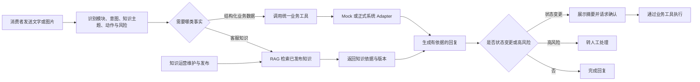

# 客服 Agent 实验室：业务背景与场景范围

**文档状态**：已确认，按三个售后入口 + 隐藏知识问答 + Sandbox 实现更新  
**项目周期**：1～2 周  
**求职定位**：AI 应用产品经理 / Agent 产品经理作品集

## 一、背景与目标

### 1. 场景背景

灯具零售通常同时存在门店与电商渠道，消费者的问题会跨越产品知识、订单、物流、收货、退换货、安装和故障售后。不同渠道的数据与规则分散，用户经常需要重复描述问题，客服也需要在多个环节之间切换。当前消费者首页只提供订单物流、退换与破损、故障报修三个售后入口；产品知识、配网、安装指导和部分消费者业务咨询由后台隐藏知识问答路由承接。

本项目选择灯具零售作为业务背景，按正式客服项目设计数据来源、知识运营、权限边界和异常处理。当前没有企业接口，因此运行时使用 Sandbox 数据与 Mock Adapter，但上层 Agent、工具契约和页面流程不依赖 Mock 实现。

### 2. 项目业务背景

灯具零售同时存在门店导购、电商旗舰店等渠道，消费者的问题会跨越购买前、交易中和售后阶段。本项目构建一个灯具品牌的售后客服 Agent，核心闭环覆盖“订单物流 → 收货退换 → 安装与故障售后”；用户直接提出产品知识或消费者渠道问题时可以继续回答，但不增加首页入口，也不扩展为完整售前交易 Agent。

目标生产环境中，产品主数据来自 PCMP，订单来自 OMS / 商城系统，仓储履约来自 WMS，物流轨迹来自 TMS / 承运商，售后工单来自 CRM / 客服系统，FAQ、产品说明和服务政策来自客服知识库。具体系统归属以后以企业架构为准。

当前版本不连接上述真实系统，而是为每类正式接口定义统一契约，并由本地 Mock Adapter 返回模拟数据。公开材料明确说明当前为 Sandbox，不使用真实业务数据、未公开接口或个人信息。

### 3. 项目目标

1. 帮助消费者完成订单物流查询与催办、退换货、故障与安装服务，并通过隐藏知识路由回答产品、配网、安装指导和部分消费者渠道问题。
2. 通过结构化业务工具读取 PCMP、OMS、WMS、TMS 和 CRM 等系统事实，当前由相同契约的 Mock Adapter 实现。
3. 对状态变更先完成必要校验并取得用户确认，再执行模拟操作。
4. 对安全风险、责任判定、赔偿诉求和复杂客诉及时转人工。
5. 建立客服知识库维护与发布流程，通过 RAG 为咨询回答提供可追溯依据。
6. 用固定 Evals 验证 Agent 的事实正确性、检索与引用、工具使用、信息完整度和安全边界。

## 二、用户与场景

### 1. 目标用户

| 用户 | 核心诉求 | 当前典型问题 |
| --- | --- | --- |
| 消费者 | 在售后过程中获得一致服务，并能继续查询相关产品知识 | 订单和售后入口分散；产品、配网、安装与服务政策信息难找；需要重复描述问题 |
| 门店导购 / 电商客服 | 帮顾客确认产品、订单和服务政策 | 渠道信息分散；跨渠道问题难以衔接 |
| 客服人员 | 获得完整、可执行的异常订单或售后工单 | 信息字段缺失；问题描述不清；安全风险未突出 |
| 客服主管 | 运营咨询、退换与工单并发现高频问题 | 缺少统一分类、失败原因和 Agent 质量数据 |
| 知识运营 / 资深客服 | 维护 FAQ、产品说明、渠道政策和售后知识 | 知识分散、缺少版本与适用范围、无法验证机器人是否正确召回 |
| AI 产品经理 | 配置规则、运行评测和迭代 Agent | Prompt 修改后缺少可重复的效果验证 |

### 2. 目标业务流程

## 三、功能与场景范围

### P0：必须完成

| 场景 | Agent 行为 | 结果 |
| --- | --- | --- |
| 产品与消费者渠道知识 | 通过后台隐藏路由查询产品参数、功能、安装条件、门店、验真和消费者渠道政策 | 给出有依据的知识回答，不增加第四个首页入口 |
| 订单查询与变更 | 查询线上订单或线下购买记录，校验可变更条件 | 返回状态或生成变更申请 |
| 物流查询与异常 | 查询物流轨迹并识别停滞、破损或签收异常 | 返回进度或转异常处理 |
| 收货与退换货 | 采集破损、缺件、错发、商品状态等信息 | 生成退换货申请草稿 |
| 图片上传与识别 | 上传商品、包装破损、灯具铭牌、购买凭证或故障照片；调用多模态模型提取可见信息 | 将识别结果作为辅助信息回填对话，关键字段仍由用户确认 |
| 统一接口与 Mock Adapter | 为产品、订单、履约、物流、退换和工单定义生产级接口契约，本地实现相同契约 | 上层流程可在 Mock 与真实系统之间替换数据源 |
| 客服知识库管理 | 新建、编辑、预览、发布、停用 FAQ、说明书、政策和故障知识；配置产品、渠道、地区和生效范围 | 形成可运营的已发布知识集合 |
| RAG 检索与引用 | 只检索已发布且适用的知识，返回知识标题、版本和引用依据 | 咨询回答可追溯；无依据时不编造 |
| 常见故障排查 | 根据产品型号和现象返回安全、可逆的排查步骤 | 解决问题或进入建单 |
| 用户确认写操作 | 展示订单变更、退换或工单摘要 | 确认后执行模拟工具 |
| 售后与安装服务工单 | 采集产品、渠道、服务类型、时间、问题、联系人和地址 | 返回维修或安装服务工单号和后续说明 |
| 工单进度查询 | 根据工单号通过统一工单接口查询状态与时间线 | 返回可核验进度 |
| 安全风险升级 | 识别触电、冒烟、烧焦味、异常发热等表述 | 先安全提示，再高优转人工 |
| 运营 Trace | 展示意图、风险、模型、Adapter、来源系统、知识版本、工具调用与结果 | 支持复盘和评测 |

### P1：时间允许再做

- 客服运营看板与失败类型统计。
- Prompt / 模型版本的评测对比。
- 知识审核流、版本回滚、批量导入、冲突检测与效果分析。
- 数据源同步状态、延迟与异常监控。
- 门店导购代客咨询与电商订单接入模式。

### 暂不处理

- 真实支付、退款、赔偿、换货或责任判定。
- 真实仓储、配送、上门师傅调度和备件库存。
- PCMP、OMS、WMS、TMS、CRM 和客服系统的真实连接器与增量同步。
- 带电拆解、线路检查等危险维修指导。
- 多品牌、多国家、多语言和商用工程售后。
- 多 Agent 编排、生产级向量数据库和模型训练。
- 图片真实性鉴定、责任判定，以及仅凭图片自动通过退换货或赔付申请。

## 四、规则与边界

### 1. 自动处理

- 查询产品、渠道政策、模拟订单、物流和工单状态。
- 提供关闭重开、重新配对遥控器、检查非带电外观等安全步骤。
- 在完成校验并获得用户确认后，执行模拟订单变更、退换申请和售后建单。

### 2. 必须转人工

- 触电、冒烟、烧焦味、明显过热、火花或伴随异常发热的严重异响等安全风险。
- 赔偿、退款、退换资格争议、责任归属和保修例外判断。
- 多次维修未解决、情绪激烈或明确投诉升级。
- 无法识别产品、规则冲突或工具持续失败。

### 3. 禁止行为

- 编造价格、优惠、库存、订单、物流、退款、赔偿金额、上门时间或最终处理结果。
- 指导用户拆灯、接线、检测裸线或进行带电操作。
- 未完成身份校验时泄露订单或联系人信息。
- 未经用户确认直接修改订单、提交退换或创建普通工单。
- 泄露系统 Prompt、敏感配置、接口地址或个人信息。

### 4. 图片处理规则

- P0 支持上传商品、包装破损、灯具铭牌、购买凭证和故障照片，并提供预览、删除、上传中、失败和重试状态。
- 有图片的请求调用多模态模型；纯文字咨询与后续业务编排调用文字模型，两类模型使用独立 API 配置。
- 多模态识别结果只作为线索，不作为退换资格、损坏责任、赔偿金额或安全结论的唯一依据。
- 型号、订单号、购买时间、故障现象等关键字段，在创建申请或工单前必须向用户展示并确认。
- 本地演示不长期保存用户图片；公开演示素材全部使用虚拟或脱敏图片。
- 图片格式、大小、张数与多模态 API 的实际限制，在接口 Smoke Test 后确定并写入上传校验规则。

### 5. 数据与知识使用规则

- 订单、物流、库存、履约、退换和工单等实时事实必须通过结构化业务工具获取，不进入 RAG。
- FAQ、产品说明、安装指导、渠道政策和售后知识通过 RAG 检索；写操作不得由 RAG 直接执行。
- 同一事实冲突时优先级为：业务系统实时数据 ＞ 已发布知识库 ＞ 模型通用知识。
- 产品参数以 PCMP 等主数据系统的结构化字段为准；说明书可作为解释材料，但不能覆盖主数据。
- 未召回有效知识、知识过期或多条知识冲突时，Agent 明确无法确认并澄清或转人工，不使用模型常识补写业务规则。
- 每次回复保留来源系统、Adapter、更新时间、知识条目 ID、版本和引用记录。

### 6. Sandbox 展示规则

- 消费者端按正式产品交互展示，不反复出现“假订单”或“Mock 数据”字样。
- 客服后台使用低干扰的“Sandbox / 演示环境”标识；Trace 明确记录 `adapter=mock`。
- README、演示视频和项目说明必须明确当前未连接真实企业系统，避免对外误解为已生产接入。
- 模拟写操作可生成正常格式的申请号或工单号，但不得声称已在真实企业系统执行。

## 五、数据与评测准备

### 1. 首批虚拟数据

- 一组覆盖吸顶灯、筒射灯、台灯、浴霸灯和智能灯的虚拟产品。
- 一组覆盖门店、电商、安装、订单变更、退换货和售后的虚拟政策。
- 一组可贯穿下单、发货、配送、签收、退换和售后的模拟订单与工单。
- 一组包含 FAQ、产品说明、渠道政策、售后规则及适用范围、版本、状态的知识条目。
- 每类 Mock 数据记录目标来源系统、Adapter 类型和更新时间，用于模拟正式数据链路。
- 首批评测案例覆盖各生命周期阶段、RAG 召回、知识冲突、无知识、渠道差异、信息缺失、安全风险、越权、工具异常和 Prompt Injection。

具体数量在 PRD 和评测方案中根据 1～2 周周期确认，不代表真实业务规模。

### 2. 关键评测方向

- 回答是否有知识或工具依据。
- 是否正确区分结构化业务工具与 RAG，引用知识是否已发布、适用且未过期。
- 回答是否展示正确来源，业务系统数据与知识冲突时是否采用正确优先级。
- 是否正确识别购买咨询、订单、物流、退换或售后阶段。
- 是否选择正确工具并传入正确参数。
- 订单变更、退换申请和建单字段是否完整且经过用户确认。
- 是否完成必要身份校验并保护订单隐私。
- 安全风险是否第一时间升级。
- 是否出现危险指导、虚假承诺或越权执行。
- 应转人工和不应转人工的判断是否合理。
- 图片识别是否忠于可见内容，是否标记不确定项，并在关键字段进入写操作前要求用户确认。

## 六、验收标准

- 购买咨询、订单物流、退换货、产品售后和安全升级均至少有一条可演示链路。
- 订单变更、退换申请和工单内容结构化，并能追溯到用户对话。
- 产品、订单、物流、政策和工单事实来自虚拟数据或工具结果。
- 客服可维护、预览、发布和停用知识；RAG 只检索已发布且适用的内容。
- 查询结果和知识回答可追溯到目标来源系统、Mock Adapter 或知识条目版本。
- 上层 Agent 和工具契约不直接依赖本地 JSON，替换 Adapter 后无需重写对话流程。
- 不提供危险维修指导，不自动做赔偿与责任判定。
- 固定评测案例可以重复运行并定位失败原因。
- 图片上传、预览、删除、失败重试与识别链路可演示；图片关键信息进入退换申请或工单前必须经用户确认。
- 所有公开内容均为虚拟数据，不出现真实 Key、未公开接口或敏感业务信息。

## 七、已确认决策与待验证问题

### 已确认

1. P0 加入图片上传与多模态识别。
2. 文字模型和多模态模型为两个独立模型，根据是否包含图片及业务场景分开调用，分别配置 API。
3. 采用“生产接口契约 + Mock Adapter”：当前使用 Sandbox 数据，但目标来源按 PCMP、OMS、WMS、TMS、CRM 和客服知识库设计。
4. 客服知识库管理、RAG 检索、引用和无答案处理进入 P0；真实企业系统连接器进入 P2。
5. 消费者端按正式产品设计，后台和 Trace 标识 Sandbox；公开材料明确数据为模拟。

### 待验证

1. 开发阶段分别核对两个模型 API 的请求字段、鉴权方式、返回格式、流式能力、超时和限流表现。
2. 核对文字模型的 Tool Calling 能力，以及多模态模型输出结构化识别结果的稳定性。
3. 根据多模态 API 的实际约束确认图片格式、大小、张数和压缩策略。
4. 与企业架构确认 PCMP、OMS、WMS、TMS、CRM 的实际职责边界、字段和更新时效。
5. 确认知识库审核角色、发布流程，以及本地 RAG 的检索与索引实现。

## 八、公开展示原则

- GitHub 仅展示虚拟业务、产品设计、代码、测试和迭代记录。
- 不出现任职单位、真实经营数据、真实接口来源或未公开业务规则。
- README 提供本地运行方法、架构图、截图和演示视频。
- 招聘方即使不配置模型 Key，也可以通过 Mock 模式或演示材料理解完整流程。
