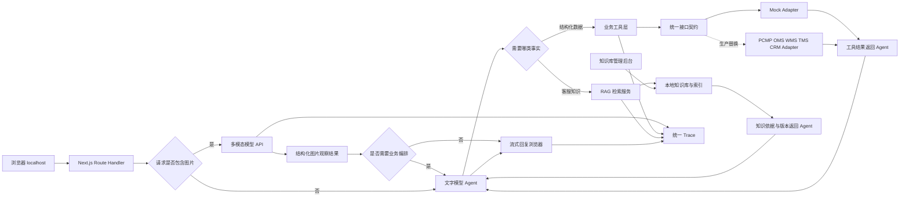

# 客服 Agent 实验室：模型接口与本地运行方案

**文档状态**：生产接口契约 + Mock Adapter 方案已确认，待收到双模型 API 后做 Smoke Test  
**运行方式**：仅本地运行，不部署服务器  
**公开方式**：GitHub 代码、提交历史、截图和演示视频

## 一、结论

- 文字模型与多模态模型使用两个独立 API：纯文字对话、业务推理与 Tool Calling 使用文字模型；图片理解使用多模态模型，只有识别后还需查询或写入业务数据时才继续调用文字模型。
- 工程采用 Next.js App Router + TypeScript，一个项目同时承载页面、本地 API 和 Agent 编排。
- 两套模型地址与 Key 仅保存在本机 `.env.local`，浏览器通过本地 Route Handler 调用模型。
- P0 支持图片上传；多模态识别结果作为结构化线索交给文字 Agent 继续追问、查工具或生成申请草稿。
- 产品、订单、履约、物流、退换和工单通过统一业务接口访问；当前由 Mock Adapter 实现，目标可替换为 PCMP、OMS、WMS、TMS 和 CRM Adapter。
- FAQ、产品说明、渠道政策和售后知识进入客服知识库，通过 RAG 检索并保留条目、版本和引用；结构化业务事实不进入 RAG。
- 消费者端按正式产品体验设计，Sandbox 仅在后台、Trace 和公开说明中标识。
- 项目不部署服务器、不购买域名，也不要求招聘方在线体验。
- 每完成一个可验证里程碑就创建一次 Git commit，后续推送到公开 GitHub 仓库，保留真实迭代轨迹。

## 二、模型与接口方案

| 检查项 | 结果 | 对实现的影响 |
| --- | --- | --- |
| 旧 Key 是否撤销 | 已撤销 | 已暴露密钥不再使用 |
| 文字模型 API | 待提供 | 负责纯文字回复、业务推理、Tool Calling 和最终答复 |
| 多模态模型 API | 待提供 | 负责理解商品、包装、铭牌、凭证和故障图片 |
| 两个 API 是否同一协议 | 待 Smoke Test | 分别封装适配器，不在业务代码中假设字段完全一致 |
| 文字模型 Tool Calling | 待 Smoke Test | 由文字模型选择业务工具并生成结构化参数 |
| 流式输出 | 待 Smoke Test | 优先用于文字模型回复；按各 API 实际能力实现 |
| 本机网络访问 | 支持 | 可以直接进行本地开发与演示 |
| GitHub 账号 | 已有 | 可以建立公开仓库并展示提交历史 |

开发阶段收到两个 API 后分别执行最小 Smoke Test，核对鉴权、请求字段、图片传输方式、返回字段、错误码、超时、限流和流式事件格式。两个模型通过独立适配器接入，避免把多模态接口硬套成文字接口。

## 三、目标架构与本地实现



浏览器不能直接调用模型 API。这样即使只在本地运行，两套 Key 也不会出现在浏览器源码和网络请求中。图片由本地 Route Handler 转发给多模态 API，默认不写入仓库或长期落盘。

业务工具只依赖统一接口契约，不直接读取 JSON。P0 的 `Mock Adapter` 与未来真实 Adapter 返回相同核心字段、错误类型和来源元数据，因此接入真实系统时不需要重写意图、确认、风控和页面流程。

### 数据来源与调用边界

| 数据 | 目标来源 | Agent 获取方式 | P0 本地实现 |
| --- | --- | --- | --- |
| 产品型号、SKU、规格、状态 | PCMP 产品主数据 | 结构化产品工具 | `ProductMockAdapter` |
| 订单、渠道、订单状态 | OMS / 商城订单系统 | 结构化订单工具 | `OrderMockAdapter` |
| 仓储、出库、履约事件 | WMS | 结构化履约工具 | `FulfillmentMockAdapter` |
| 物流轨迹 | TMS / 承运商 | 结构化物流工具 | `LogisticsMockAdapter` |
| 退换、售后和工单 | CRM / 客服系统 | 结构化读写工具 | `ServiceMockAdapter` |
| FAQ、说明书、政策、故障知识 | 客服知识库 | RAG 检索与引用 | 本地知识库 + 本地索引 |

以上系统归属为目标架构示例，实际职责边界待企业接口阶段确认。

### 模型路由规则

| 输入场景 | 调用路径 | 说明 |
| --- | --- | --- |
| 纯文字咨询或查询 | 文字模型 → 业务工具或 RAG | 根据事实类型选择结构化查询或知识检索 |
| 仅需看图回答 | 多模态模型 → 回复 | 例如读取铭牌或描述可见破损，不额外调用文字模型 |
| 图片 + 业务查询 / 申请 | 多模态模型 → 文字模型 → 业务工具或 RAG | 先提取可见事实，再完成业务判断、追问或写操作确认 |
| 图片识别失败 | 文字模型澄清或提示重新上传 | 不根据低置信结果自动建单或判责 |
| 后续纯文字追问 | 文字模型读取会话中的图片观察摘要 | 避免每轮重复发送图片；用户要求重新识别时再调用多模态模型 |

多模态模型输出建议统一为内部结构：`imageType`、`observations`、`candidateFields`、`uncertainties`、`safetySignals`。这只是应用内部 Schema，最终字段需结合实际 API 能力确认。

## 四、方案对比

### 数据集成架构

| 方案 | 原理一句话 | 效果 | 成本与工期 | 风险 | 推荐度 |
| --- | --- | --- | --- | --- | --- |
| 页面直读 Mock JSON | 页面和工具直接绑定本地文件 | 最快形成 Demo | 最低 | 接真实系统时需重写，难体现正式架构 | ★★ |
| 生产接口契约 + Mock Adapter | 先定义正式工具与数据契约，本地用 Mock Adapter 实现 | 保留本地可运行，同时具备真实系统替换路径 | 中等 | 需要提前定义字段、来源与异常 | ★★★★★ |
| 立即开发真实连接器 | 直接连接 PCMP、WMS 等企业系统 | 最接近上线环境 | 高 | 当前无接口、网络和权限，无法验证 | 暂不采用 |

**采用生产接口契约 + Mock Adapter。** Mock 是当前数据实现，不是产品架构；上层 Agent、工具、RAG、权限和 Trace 按正式项目设计。

### 本地工程技术栈

| 方案 | 原理一句话 | 效果 | 成本与工期 | 风险 | 推荐度 |
| --- | --- | --- | --- | --- | --- |
| Next.js 本地全栈 | App Router 同时承载页面、Route Handler 和 Agent | 单仓库、单命令运行，适合流式响应 | 低，适合 1～2 周 | 需要理解服务端与客户端边界 | ★★★★★ |
| React/Vite + Express | 前后端分别启动，Express 代理模型 | 分层清晰 | 中等 | 两个进程与两套配置增加复杂度 | ★★★ |
| 纯 React 直接请求模型 | 浏览器直接调用 API | 实现最快 | 低 | Key 会暴露，不能用于公开仓库 | 不采用 |

**推荐 Next.js 本地全栈。** Next.js Route Handler 支持流式响应，非 `NEXT_PUBLIC_` 环境变量只在服务端可见，适合本地 AI Agent 项目。

## 五、本地环境

### 需要安装

- Git。
- Node.js 当前 LTS 版本。
- npm，项目统一使用一种包管理器。
- VS Code、Cursor 或 Codex 等开发工具。

### 环境变量

工程只提交变量名，不提交真实值：

```text
TEXT_MODEL_BASE_URL=
TEXT_MODEL_API_KEY=
TEXT_MODEL_NAME=
VISION_MODEL_BASE_URL=
VISION_MODEL_API_KEY=
VISION_MODEL_NAME=
MODEL_MODE=mock
BUSINESS_ADAPTER=mock
KNOWLEDGE_ADAPTER=local
APP_ENV=sandbox
```

- 两套模型的真实值只写入 `.env.local`。
- `.env.local` 必须加入 `.gitignore`。
- 不使用 `NEXT_PUBLIC_` 前缀保存模型 Key。
- `.env.example` 只放空值和填写说明。
- `BUSINESS_ADAPTER=mock` 表示当前使用本地实现，但业务工具只依赖统一接口契约。
- `KNOWLEDGE_ADAPTER=local` 表示知识条目与检索索引在本地运行，未来可替换为企业知识服务。
- `APP_ENV=sandbox` 供后台和 Trace 标记运行环境，消费者端不展示高干扰 Mock 标签。

### 运行方式

开发完成后，README 提供三步启动说明：

1. 安装依赖。
2. 复制 `.env.example` 为 `.env.local` 并填入个人配置。
3. 启动本地开发服务，浏览器访问 `http://localhost:3000`。

## 六、Sandbox 与 Adapter 定义

项目区分模型、业务数据和知识三层运行方式：

- **业务 Mock Adapter**：P0 使用。产品、订单、履约、物流、退换和工单由本地数据实现正式接口契约，Trace 记录 `adapter=mock` 和目标来源系统。
- **本地知识 Adapter**：P0 使用。客服在知识库后台维护内容，RAG 只检索已发布且适用的知识，并返回条目 ID、版本和引用。
- **模型 Mock**：用于无 Key 演示。`MODEL_MODE=mock` 时不调用文字或多模态 API；配置两套 API 后可切换为 `MODEL_MODE=live`。

模型 Mock 模式提供：

- 使用预设模型回复和工具调用轨迹。
- 可以点击体验购买咨询、订单物流、退换货、售后建单和安全升级。
- 消费者页保持正式产品体验；客服后台低干扰显示“Sandbox”，Trace 明确模型模式与 Adapter。
- README 同时提供截图、GIF 或短视频。

模型 Live 与 Mock 模式共用相同页面、模型适配器接口、工具 Schema 与交互流程；业务 Mock Adapter 与未来真实 Adapter 共用业务接口契约。README 和演示材料明确当前未连接真实企业系统。

### RAG 与结构化工具边界

- 订单、物流、库存、履约、退换和工单走结构化业务工具，不写入向量索引。
- FAQ、产品说明、安装指导、渠道政策和售后知识走 RAG。
- 产品结构化参数以 PCMP 契约结果为准；知识文章用于解释，不覆盖主数据。
- 写操作只能由业务工具执行，RAG 不具有写权限。
- 未召回有效知识、知识过期或知识冲突时明确无法确认并澄清或转人工。
- 每次知识回答记录检索条件、召回条目、版本、引用和最终是否使用。

### P0 知识库管理

- 支持 FAQ 和文档型知识的新建、编辑、预览、发布、停用。
- 配置知识类型、适用产品、渠道、地区、生效时间、来源和维护人。
- 发布前可以预览切片与检索结果，确认某个问题会召回哪些知识。
- P0 使用草稿、已发布、已停用三种状态；审核流、批量导入、冲突检测和版本回滚放入 P1。

## 七、P0 图片上传设计

- 聊天输入区支持选择图片、预览、删除、补充文字描述和发送。
- 上传过程展示处理中状态；格式不支持、文件过大、读取失败、模型超时和识别失败均给出明确提示与重试入口。
- 图片仅用于当前会话识别，默认不长期保存；Trace 只记录图片类型、大小、调用状态和结构化观察摘要，不记录 Base64 或模型密钥。
- 图片识别不能直接决定退换资格、责任或赔偿；创建退换申请和售后工单前，关键字段仍需用户确认。
- 允许的格式、单图大小、单次张数及是否需要前端压缩，待多模态 API Smoke Test 后定稿。

## 八、GitHub 渐进式提交方案

项目从文档阶段开始保留真实提交历史，不在最后一天一次性上传。

| 提交阶段 | 建议提交内容 | Commit 示例 |
| --- | --- | --- |
| 1. 项目定义 | README、业务范围、本地技术方案 | `docs: define customer service agent scope` |
| 2. PRD | 用户场景、功能边界、指标与验收 | `docs: add product requirements and guardrails` |
| 3. 可点击原型 | 五个页面、知识运营和全周期主流程 | `prototype: add interactive customer service flows` |
| 4. 工程初始化 | Next.js、统一接口契约、Mock Adapter 和 Sandbox 数据 | `chore: initialize local Next.js workspace` |
| 5. 双模型与图片 | 文字 / 多模态适配器、路由、上传与异常态 | `feat: add multimodal upload and model routing` |
| 6. 数据工具与 Adapter | 产品、订单、履约、物流和工单契约及 Mock 实现 | `feat: add business adapters and tools` |
| 7. 知识库与 RAG | 知识维护、发布、检索和引用 | `feat: add knowledge management and rag` |
| 8. 写操作 | 订单变更、退换、售后工单与确认 | `feat: add confirmed service actions` |
| 9. 安全与 Trace | 权限、来源、知识版本和工具轨迹 | `feat: add guardrails and execution trace` |
| 10. Evals | 测试集、RAG / 工具评分和结果页 | `test: add lifecycle agent evaluations` |
| 11. 作品集包装 | 截图、视频、架构图和复盘 | `docs: finalize portfolio walkthrough` |

提交规则：

- 一个提交对应一个能解释清楚的产品或工程变化。
- 提交前确保当前版本可以打开或通过对应检查。
- 不制造虚假历史，不回填不存在的开发日期。
- 不用大量无意义空提交增加数量。
- 尽量不强制改写已公开的 Git 历史。
- README 持续记录“本次解决了什么问题”和下一步计划。

## 九、GitHub 公开内容边界

允许提交：

- 虚拟产品、订单、履约、物流、政策、退换、工单和知识数据。
- 统一接口契约、Mock Adapter、目标来源映射和本地 RAG 设计。
- PRD、架构、Prompt 设计思路、工具 Schema、Evals 和测试结果。
- 截图、演示视频、失败案例和迭代记录。

禁止提交：

- `.env.local`、真实 API Key 和 Authorization Header。
- 未公开 API 地址、真实业务规则、真实订单或个人信息。
- 本项目目录中的私人参考素材或未经处理的原始工作文件。
- `.DS_Store`、构建缓存、依赖目录和本地日志。

## 十、开发阶段 Smoke Test

1. 文字模型是否返回中文结果，以及流式事件、结束标记与中断行为。
2. 文字模型能否正确选择产品、订单、履约、物流工具，并通过 Mock Adapter 生成符合 Schema 的参数。
3. 多模态模型能否接收目标图片格式，并稳定提取铭牌、包装破损、购买凭证和故障现象中的可见信息。
4. 图片与文字同时输入时，两步模型调用能否正确衔接；后续追问是否复用观察摘要而不重复传图。
5. 模型能否为订单变更、退换申请和售后工单生成符合 Schema 的参数。
6. 两个 API 任一超时、限流或返回异常时，是否明确失败并允许重试，而不是伪装成功。
7. 图片格式、大小、张数、压缩质量，以及两个模型的 Token、耗时和并发限制。
8. Mock Adapter 是否与统一契约一致，来源系统、更新时间和错误类型是否完整记录。
9. RAG 是否只召回已发布且适用的知识，并正确处理无结果、过期和冲突知识。
10. 结构化数据与知识冲突时，是否执行“业务系统数据优先”的规则。

## 十一、验收标准

- 一条命令可以启动完整本地项目。
- 纯文字请求走文字模型 API；带图请求走多模态模型 API，仅在需要业务查询或写操作时继续交给文字模型，路由可在 Trace 中核验。
- 图片上传具备预览、删除、处理中、失败与重试状态，识别结果不得未经确认直接触发高风险写操作。
- 文字对话、Tool Calling、图片理解和流式输出分别通过实际 Smoke Test。
- 浏览器源码、浏览器直发请求和 GitHub 中均看不到两套模型 Key。
- 没有模型 Key 时可以通过模型 Mock 模式体验主要流程；所有业务工具在本地 Mock 下可运行。
- 产品、订单、履约、物流、退换和售后工具至少各完成一次 Mock Adapter 调用验证。
- 客服可新建、编辑、预览、发布和停用知识，RAG 只使用已发布且适用的内容。
- 业务结果可追溯到目标来源系统与 Adapter，知识回答可追溯到条目 ID、版本和引用。
- 消费者端保持正式产品体验；后台和 Trace 标记 Sandbox；README 明确当前数据为模拟。
- GitHub 有按阶段形成的真实提交历史，而非单次大提交。
- README 包含启动说明、截图、演示视频、架构图、关键决策和复盘。
