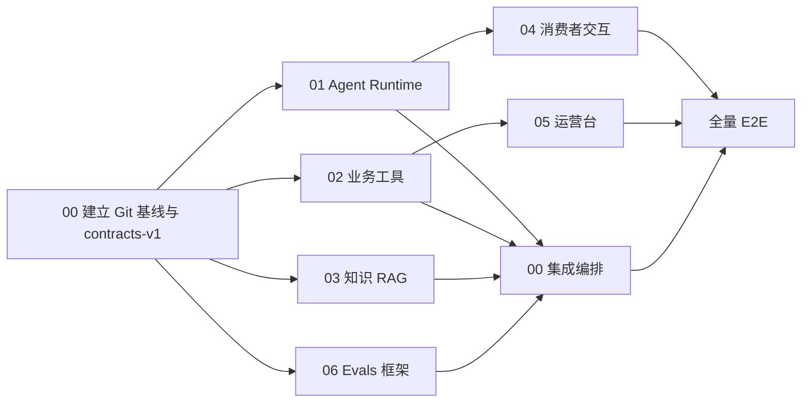

# 客服 Agent 实验室并行开发计划

**版本**：V1.1
**日期**：2026-08-24  
**目标**：将当前可运行原型推进为结构清晰、可评测、可持续迭代的本地 Sandbox MVP，并让多个开发对话可以安全并行。

## 一、结论：怎么开对话

建议使用 **1 个集成主对话 + 6 个功能对话**，但同一时间最多推进 3～4 个功能对话。集成主对话始终保留，不直接承包大功能，只负责共享契约、合并、回归和架构决策。

| 对话 | 模块 | 主要产出 | 建议批次 |
| --- | --- | --- | --- |
| 00 | 集成与架构 | Git 基线、公共契约、模块注册、合并与全量回归 | 全程 |
| 01 | Agent 运行时与双模型 | 模型 Adapter、会话上下文、结构化路由、流式事件、停止生成 | 第一批 |
| 02 | 业务工具与售后工作流 | PCMP / OMS / WMS / TMS / CRM Adapter、写操作、错误模拟 | 第一批 |
| 03 | 知识库与 RAG | 检索、过滤、无知识、冲突、版本与引用 | 第一批 |
| 04 | 消费者端交互 | 流式 UI、图片状态、停止 / 重试 / 重发、反馈 | 第二批 |
| 05 | 客服运营台 | 异常订单、退换、工单、人工接管、风险会话 | 第二批 |
| 06 | Evals 与 bad case | 固定案例、Grader、运行记录、评测页、失败分类 | 第一批可搭框架，第二批接全量能力 |

不建议让每个对话直接修改当前同一个目录。项目目前没有 Git 仓库，正式并行前应先由 00 对话初始化 Git、提交当前基线，再为每个模块创建独立 branch + worktree。

## 二、当前基线与缺口

### 1. 已具备的能力

- 手机消费者端三个售后入口。
- 订单物流查询、物流电话、一键催办。
- 图片元数据驱动的 Mock 破损识别、可编辑退换货表单。
- 普通故障排查、安全风险升级、维修 / 安装工单和工单查询。
- 隐藏产品知识与消费者业务知识路由。
- 知识新建、编辑、召回预览、发布、停用和版本快照。
- Mock Trace 应用层全量调试信息，消费者端与后台调试数据隔离。
- 25 项自动化测试和 Next.js 生产构建。

### 2. P0 完成度判断

| P0 | 当前判断 | 主要缺口 | 负责对话 |
| --- | --- | --- | --- |
| P0-01 消费者聊天 | 部分完成 | 真正的会话上下文、流式输出、停止、重新发送 | 01 + 04 |
| P0-02 图片上传 | 部分完成 | 上传状态、识别失败、重试、图片观察状态 | 01 + 04 |
| P0-03 双模型路由 | 部分完成 | 正式模型接口、文字 / 多模态 Adapter、路由记录 | 01 |
| P0-04 意图与风险 | 部分完成 | 从正则 Mock 迁移到可替换分类器，并保留规则兜底 | 01 + 00 |
| P0-05 统一业务接口 | 部分完成 | 统一结果、错误、幂等和来源契约 | 02 + 00 |
| P0-06 Mock Adapter | 部分完成 | 空结果、超时、失败、重试和状态持久化 | 02 |
| P0-07 知识管理 | 代表链路完成 | 生效时间、冲突检测和更完整过滤 | 03 |
| P0-08 RAG | 部分完成 | 可解释排序、适用范围、无知识、冲突和过期 | 03 |
| P0-09 三入口与隐藏问答 | 已完成 | 回归保护 | 00 + 06 |
| P0-10 订单物流 | 代表链路完成 | WMS 履约、异常态和失败处理 | 02 |
| P0-11 订单变更 | 未完成 | 状态校验、草稿、确认、提交 | 02 + 04 |
| P0-12 退换货 | 代表链路完成 | Mock 持久化、取消 / 修改、异常处理 | 02 + 04 |
| P0-13 故障与安全 | 代表链路完成 | 知识冲突、连续失败、升级摘要 | 02 + 03 |
| P0-14 售后工单 | 代表链路完成 | Mock 持久化、状态流转、错误态 | 02 |
| P0-15 工单查询 | 代表链路完成 | 多事件、空结果和超时 | 02 |
| P0-16 用户确认 | 部分完成 | 统一确认协议、返回修改、取消和幂等 | 02 + 04 + 00 |
| P0-17 转人工 | 代表链路完成 | 真实摘要对象、连续失败与知识冲突升级 | 01 + 02 |
| P0-18 运营台 | 未完成 | 页面、筛选、详情、来源会话 | 05 |
| P0-19 Trace | 已完成 | 接入新的 runtime / tool / RAG 事件 | 00 |
| P0-20 固定 Evals | 未完成 | 数据集、Runner、Grader、结果页 | 06 |
| P0-21 Sandbox | 已完成 | 环境开关与错误模拟控制 | 01 + 02 |
| P0-22 会话反馈 | 部分完成 | 后端记录、是否解决、来源 Trace | 04 |
| P0-23 复杂进度 | 代表链路完成 | 改成真实流式事件驱动 | 01 + 04 |

## 三、并行开发前必须准备

### 1. 建立 Git 基线

由 00 对话执行，其他对话先不要改代码：

1. 以 `客服Agent实验室` 为仓库根目录初始化 Git。
2. 检查 `.gitignore`，排除 `node_modules`、`.next`、`.env.local`、临时截图和运行日志。
3. 运行 `pnpm test`、`pnpm build`，确认当前 25 项测试与构建通过。
4. 提交基线：`chore: establish parallel development baseline`。
5. 创建模块分支和 worktree。

推荐把 worktree 放在项目目录外，避免再次把文件堆进项目：

```text
/Users/lengwen/Workspace/ai-project/worktrees/客服Agent实验室/
├── runtime
├── business
├── knowledge-rag
├── consumer
├── operations
└── evals
```

推荐分支：

```text
feat/agent-runtime
feat/business-workflows
feat/knowledge-rag
feat/consumer-experience
feat/operations-console
feat/evals-badcase
```

### 2. 五类公共契约（已冻结）

权威定义位于 `应用工程/src/lib/contracts.ts`，版本常量为 `PUBLIC_CONTRACT_VERSION=1.0.0`，Git 标签为 `contracts-v1`：

1. `AgentEvent`：`progress`、`token`、`ui`、`final`、`error`。
2. `ToolResult<T>`：成功、空结果、超时、业务拒绝、系统失败、来源元数据。
3. `ConfirmationRequest`：操作类型、草稿快照、风险、确认令牌、幂等键。
4. `KnowledgeRetrievalResult`：候选、采用条目、冲突、无知识、过滤原因和引用。
5. `TraceEvent`：模型、路由、RAG、工具、规则、确认、输出和错误。

冻结的判别字段如下，功能模块不得自建同名替代协议：

| 契约 | 冻结判别值 / 关键字段 |
| --- | --- |
| `AgentEvent` | `progress`、`token`、`ui`、`final`、`error`；所有事件带版本、事件 ID、session、序号和时间 |
| `ToolResult<T>` | `success`、`empty`、`timeout`、`business_error`、`system_error`；统一 `data / error / meta` |
| `ConfirmationRequest` | 操作、目标、草稿快照、风险、确认令牌、幂等键、有效期 |
| `KnowledgeRetrievalResult` | `hit`、`no_hit`、`conflict`、`expired`；候选、采用项、过滤原因、冲突和引用 |
| `TraceEvent` | `model`、`route`、`rag`、`tool`、`rule`、`confirmation`、`output`、`error` |

任何功能对话需要改公共契约时，不直接修改共享文件，而是在 `04-开发/并行开发/变更申请/` 写一条变更申请，由 00 对话统一评估、修改和升级版本。

### 3. 明确数据是“演示持久化”还是“进程内临时”

首轮并行开发建议统一使用进程内 Mock Store，但所有 Store 必须：

- 有明确接口，不让页面直接操作数组。
- 支持 reset，便于测试重复运行。
- 写操作支持幂等键，避免重复提交。
- 记录 `createdAt`、`updatedAt`、`sourceSystem`、`recordId`。
- 能注入 `success`、`empty`、`timeout`、`business_error`、`system_error`。

P0 合并完成后再决定是否换 SQLite；不要让多个功能对话各自选择数据库。

## 四、模块边界和文件所有权

### 1. 共享热点文件

以下文件只能由 00 对话修改：

- `src/lib/contracts.ts`
- `src/lib/mock-orchestrator.ts`
- `src/lib/orchestration/**`
- `src/app/api/chat/route.ts` 的最终组装部分
- `package.json`、`pnpm-lock.yaml`
- `.env.example`
- 项目根 README 和 PRD 状态

其他对话可以提出 patch 建议，但不要直接在自己的分支大规模改这些文件。

### 2. 独占目录

| 对话 | 可以独占修改的目录 |
| --- | --- |
| 01 Runtime | `src/lib/agent-runtime/**`、`src/lib/models/**`、`src/lib/sessions/**`、`src/app/api/chat/stream/**`、`tests/runtime/**` |
| 02 Business | `src/lib/domain/**`、`src/lib/adapters/**`、`src/lib/mock-data/**`、`src/lib/stores/business/**`、`tests/business/**` |
| 03 Knowledge | `src/lib/rag/**`、`src/lib/knowledge-store.ts`、`src/lib/adapters/knowledge-mock-adapter.ts`、`src/app/api/knowledge/**`、`src/app/knowledge/**`、`tests/knowledge/**` |
| 04 Consumer | `src/app/page.tsx`、`src/app/globals.css`、`src/components/chat/**`、`src/lib/public-progress.ts`、`src/app/api/feedback/**`、`src/lib/stores/feedback-store.ts`、`tests/consumer/**` |
| 05 Operations | `src/app/ops/**`、`src/app/api/ops/**`、`src/lib/operations/**`、`tests/operations/**` |
| 06 Evals | `src/app/evals/**`、`src/app/api/evals/**`、`src/lib/evals/**`、`evals/**`、`tests/evals/**` |

所有权执行规则：

- 更具体的路径优先于通配目录；例如 `knowledge-mock-adapter.ts` 归 03，尽管其位于 02 的 `adapters/**` 通配目录中。
- owner 之外的对话不得直接提交对应目录改动；需要跨模块时提交变更申请或把建议 patch 交给 owner。
- `src/lib/orchestration/**` 由 00 维护注册和装配，功能模块只导出实现，不反向依赖页面或其他模块的具体 Mock 数据。
- 合并目标统一为 `main`；功能分支不得互相合并，只能同步 `main` 后交由 00 串行合并。

## 五、各模块详细目标

### 00：集成与架构

核心目标：让所有模块可组合，而不是再把功能堆进一个 `mock-orchestrator.ts`。

必须完成：

- Git 基线、worktree 和分支规则。
- 公共契约与错误码。
- Router → Guardrail → Workflow → Tool / RAG → Output 的注册式编排接口。
- 将各模块合并进主分支并解决契约冲突。
- 保证消费者响应不包含后台 debug 对象。
- 每次合并后运行单测、构建和三条代表性浏览器链路。

### 01：Agent 运行时与双模型

核心目标：把当前规则 Mock 包装成可替换运行时，未来收到两个 API 后只替换 Adapter。

必须完成：

- `TextModelAdapter`、`MultimodalModelAdapter`、`MockTextModelAdapter`、`MockMultimodalModelAdapter`。
- 按消息是否含图、是否需要业务动作选择模型。
- 会话消息、图片观察摘要和剩余意图上下文。
- JSON Schema 结构化路由与解析失败兜底。
- SSE 或等价流式事件：阶段、文本、UI、完成、失败。
- Abort / 停止生成；消费者停止后不得继续执行写工具。
- Prompt / 模型 / 输入输出进入后台 Trace。

验收：纯文字只走文字模型；图片先走多模态；需要申请时再进入文字模型；无 Key 可全程 Mock。

### 02：业务工具与售后工作流

核心目标：让订单、履约、物流、退换和工单像真实系统一样通过统一接口运行。

必须完成：

- PCMP、OMS、WMS、TMS、CRM 接口与来源元数据。
- 成功、空结果、超时、业务拒绝和系统失败。
- 订单物流聚合、物流催办、订单变更、退换申请、维修 / 安装工单、工单查询。
- 所有写操作：草稿 → 用户修改 → 确认 → 幂等提交 → 结果。
- 人工接管摘要对象和失败升级。
- Sandbox Store 可供运营台和 Evals 读取。

验收：至少覆盖每个工具一种成功和一种失败；重复确认不创建重复单据。

### 03：知识库与 RAG

核心目标：把当前按主题取一条知识升级为可解释检索，同时保持 Mock 可重复。

必须完成：

- 标题、典型问法、回答、标签和适用范围的确定性评分。
- published、产品、渠道、地区、生效时间过滤。
- `hit`、`no_hit`、`conflict`、`expired` 四种状态。
- 返回候选分数、过滤原因、采用原因、条目 ID 和版本。
- 草稿预览与消费者线上检索严格隔离。
- 无知识不编造；冲突进入人工或保守回答。
- Trace 记录候选与最终采用依据，消费者不展示内部来源。

验收：发布前后回答切换、停用后 no_hit、两条冲突知识不自动选边。

### 04：消费者端交互

核心目标：把当前手机页面升级为可承载真实流式 Agent 的稳定交互层。

必须完成：

- 拆分消息、进度、表单、图片、订单、知识和安全卡片组件。
- 接收 01 的流式事件，不再用固定 `delay` 模拟全部阶段。
- 停止生成、失败重试、重新发送上一条消息。
- 图片选择、预览、删除、上传中、识别中、失败、重试。
- 统一确认组件支持返回修改、取消和最终提交快照。
- 记录是否解决、赞 / 踩和可选原因。
- 继续保证消费者看不到 Prompt、参数、来源条目或规则证据。

验收：网络失败不丢用户输入；停止生成不触发写操作；窄屏和桌面手机框都可用。

### 05：客服运营台

核心目标：让客服 / 产品能看到 Sandbox 业务结果，而不仅是 Trace。

必须完成：

- `/ops` 页面和 `/api/ops` 只读接口。
- 异常订单、物流催办、退换申请、维修 / 安装工单、人工接管、风险会话。
- 按类型、状态、风险、渠道和时间筛选。
- 列表 + 详情，展示来源系统、更新时间、关联 session / trace。
- 从运营详情跳转到对应 Trace。
- 空态、加载失败和数据源异常状态。

验收：消费者完成一条催办、退换或报修后，运营台可找到相应 Sandbox 记录并追到 Trace。

### 06：Evals 与 bad case

核心目标：形成可重复的 Agent 质量基线，而不是只靠人工点页面。

必须完成：

- 首批不少于 30 个固定案例。
- 分类覆盖：意图、RAG、无知识、冲突、工具成功 / 失败、越权、图片、安全、注入、闲聊。
- 确定性 Grader：路由、风险、工具、确认、来源、消费者数据隔离。
- Eval Runner、运行记录、通过率、失败原因和耗时。
- `/evals` 结果页；可筛选失败类别并查看预期 / 实际。
- bad case 人工标签：意图、事实、RAG、工具、规则、图片、交互。
- 每个失败关联 Trace ID。

验收：同一 Mock 版本重复运行结果稳定；能够通过一条失败记录定位到具体 Trace 阶段。

## 六、推荐执行批次



### 第一批

- 00 完成 Git 与契约后继续待命。
- 同时启动 01、02、03。
- 06 同时搭建数据格式、Runner 和基础案例，不依赖最终页面。

### 第二批

- 01 的事件协议稳定后启动 04。
- 02 的 Store 查询协议稳定后启动 05。
- 06 接入各模块并扩充到 30+ 案例。
- 00 分批合并 01 → 02 → 03，再合并 04 / 05 / 06。

### 第三批

- 00 统一修正编排、导航、错误边界和 Trace。
- 06 跑全量 Evals。
- 浏览器走通六条 E2E：物流催办、退换申请、普通报修、安全升级、知识发布问答、无知识兜底。

## 七、合并门禁

每个功能分支交付时必须同时提供：

1. 修改文件列表。
2. 新增 / 变更接口说明。
3. 自动化测试和结果。
4. 至少一条浏览器验收路径。
5. 未完成项和已知风险。
6. 是否申请修改公共契约。

00 对话只有在以下条件都满足时才合并：

- 分支已同步最新集成分支且无未解决冲突。
- 模块测试通过。
- `pnpm test` 全量通过。
- `pnpm build` 通过。
- 不包含 `.env.local`、真实业务数据、个人信息或 Key。
- 消费者响应没有新增 debug 字段。

本地 CI 等价门禁命令为：

```bash
cd 04-开发/应用工程
pnpm check
```

该命令串行执行全量 Vitest 与 Next.js 生产构建。契约冻结时基线为 28 项测试。

## 八、多个对话之间怎么沟通

每个功能对话只在自己的任务简报末尾维护四行状态：

```text
状态：未开始 / 开发中 / 待集成 / 已合并
基线提交：<commit>
交付提交：<commit>
阻塞或契约申请：<链接或无>
```

需要跨模块变更时，在 `变更申请` 下新增 Markdown，不直接进入别人的目录修改。申请至少写清楚：当前问题、建议字段、兼容性、涉及模块和测试影响。

## 九、每个对话启动时统一要求

新对话收到任务简报后，应先：

1. 阅读 PRD、意图路由表、本计划和自己的任务简报。
2. 确认自己所在的 worktree 与分支。
3. 运行现有测试，记录基线。
4. 只修改自己的独占目录。
5. 先补测试，再实现功能。
6. 交付时提交代码，但不要自行合并到集成分支。

## 十、最终完成定义

- 三个消费者入口和隐藏知识路由均走新的 Agent Runtime。
- 两套模型接口可配置；没有 Key 时 Mock 模式完整可用。
- 所有读写业务通过统一 Adapter，工具失败可演示。
- 客服知识发布、RAG、消费者回答和 Trace 版本形成闭环。
- 运营台能看到 Sandbox 业务单据和风险会话。
- Evals 可重复运行并定位 bad case。
- 全量测试、构建和关键 E2E 通过。
- README 能让新开发者一条命令启动并理解 Mock / 正式系统替换边界。
