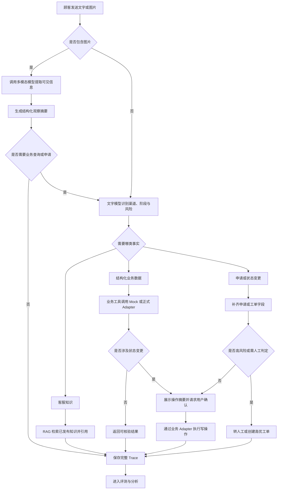

# 客服 Agent 实验室

> GitHub 仓库建议名：`customer-service-agent-lab`

一个面向灯具线下门店与电商渠道的售后客服 Agent：聚焦订单物流、退换破损和故障报修三类服务，通过统一业务接口、RAG、受控写操作和固定评测形成正式项目闭环。当前本地 Sandbox 使用 Mock Adapter，未来可替换为 PCMP、OMS、WMS、TMS、CRM 和企业知识服务。

**当前状态**：PRD V1.5 与手机端原型已完成；消费者端保留订单物流、退换破损、故障报修三个入口，后台采用业务模块、用户目标、知识主题、执行动作四维路由，并提供 Mock 应用层全量调试 Trace  
**作品集定位**：面向 AI 应用产品经理 / Agent 产品经理岗位，重点展示业务场景拆解、Agent 工作流、Human-in-the-loop、Guardrails、Evals 和落地指标，不以底层模型研发为重点。

## 快速启动

环境要求：Node.js 20+、pnpm。

```bash
cd 04-开发/应用工程
pnpm install
pnpm dev
```

浏览器访问终端显示的本地地址即可。默认使用 `MODEL_MODE=mock`，不需要模型 Key；运行 `pnpm test` 可执行规则与主流程测试，运行 `pnpm build` 可验证生产构建。

- 消费者端：`http://localhost:3000/`
- 后台 Trace 控制台：`http://localhost:3000/trace`

当前真实可运行链路：

- 订单物流 → 演示身份确认 → OMS / TMS Mock Adapter → 承运商、运单、客服电话与时间线。
- 物流催办 → 展示当前物流摘要 → 用户确认 → TMS 催办 + CRM 人工客服同步。
- 冒烟 / 烧焦味 → 安全规则 → 断电提示 → 自动升级人工。
- 图片破损 → Mock 多模态观察 → 用户编辑退换货表单 → 确认 → CRM Mock Adapter。
- 普通闪烁故障 → 已发布故障知识 → 安全排查 → 用户编辑报修单 → 确认 → CRM Mock Adapter。
- 服务进度 → 演示身份确认 → CRM Mock Adapter → 工单状态与事件时间线。

消费者端不展示回答依据和调试详情；复杂任务只展示“验证权限、读取数据、创建申请”等精简进度。应用 System Prompt、模型消息、输出 Schema、few-shot ID、候选意图、置信度、规则证据、实体、Mock 原始输出、最终决策、来源系统、知识版本、工具耗时和脱敏接口参数记录在 `/api/trace`，并在独立的 `/trace` 后台查询。当前 Trace 使用进程内 Mock 存储，重启服务后会清空。

## 一、背景与目标

项目按正式灯具售后客服设计，消费者首页收敛为“订单物流 → 收货退换 → 故障报修”。结构化业务事实通过统一工具与 Adapter 获取，产品知识、退换规则、配网、安装指导、安全排查和售后政策由客服知识库维护并通过 RAG 使用；这些知识问答由后台隐藏路由承接，不增加第四个首页入口。加盟、供应商、营销活动等非消费者售后问题只提供渠道指引。当前只运行虚拟数据和本地 Adapter，不使用欧普内部规则、接口或真实业务数据。

项目目标：

1. 做出一个可从 GitHub 获取并在本地启动的 Sandbox；没有模型 Key 时也能用预设模型响应体验主流程。
2. 每个生命周期阶段至少走通一条代表性链路，并展示正确的工具、Adapter、来源系统或知识引用。
3. 订单修改、取消、退换货申请和建单必须经用户确认；赔偿、责任判定和安全风险必须转人工。
4. 建立固定测试案例和评测看板，不只展示“看起来能用”。
5. 客服可以维护、发布和停用知识，RAG 无有效依据时不编造。
6. 在 GitHub 中留下清晰的产品文档、生产目标架构、代码、测试和迭代记录。

## 二、用户与场景

### 目标用户

- 消费者：查询订单物流、申请退换、排查故障、创建或查询售后工单。
- 门店导购 / 电商客服：协助用户确认产品、订单、渠道政策和服务入口。
- 客服人员 / 主管：处理异常订单、退换货和售后工单，查看 Agent 对话与风险标记。
- 知识运营 / 资深客服：维护 FAQ、产品说明、渠道政策和售后知识，验证机器人召回效果。
- 产品经理：配置知识、运行评测、比较 Prompt 或模型版本。

### MVP 业务背景

目标架构按 PCMP、OMS、WMS、TMS、CRM 和客服知识库划分数据来源。当前不接真实系统，而是用 Mock Adapter 实现相同接口契约；所有写操作只作用于 Sandbox 数据副本。

### 典型场景

1. 订单物流：“昨天就显示到站，为什么还没送？”→ 查询物流轨迹与承运商联系方式；用户可电话联系或确认后一键催办并同步人工客服。
2. 收货与退换：“灯罩碎了，怎么换？”→ 识别图片中的可见问题，允许用户编辑申请表后创建退换货申请。
3. 普通故障：“客厅灯一直闪。”→ 识别具体故障，进行不拆机的安全排查；无法解决时创建售后工单。
4. 安全故障：“灯有烧焦味，还冒烟。”→ 在故障报修模块中优先命中安全路由，立即提示断电并升级人工。
5. 产品知识：“这款浴霸是单电机还是双电机？”→ 命中后台隐藏知识路由，优先读取产品主数据或已发布知识，回答后仍提供三个售后入口。
6. 安装服务：“想预约师傅上门安装。”→ 创建 `serviceType=installation` 的可编辑服务工单，确认后提交。
7. 闲聊与兜底：“你好”“我想申请成为供应商。”→ 问候正常回应；非消费者业务只提供官方渠道指引，不误调用售后业务工具。

## 三、功能列表

### P0：形成可演示闭环

- 顾客聊天界面，支持流式回复和会话上下文。
- 图片上传与多模态识别：支持商品、包装破损、铭牌、购买凭证和故障照片的预览、删除、识别失败与重试。
- 生产接口契约 + Mock Adapter：产品、订单、履约、物流、退换和工单工具可替换数据来源。
- 客服知识库后台：新建、编辑、预览、发布和停用 FAQ / 文档知识，配置适用范围和生效时间。
- RAG 检索与引用：只检索已发布且适用的知识，无结果、过期或冲突时不编造。
- 三入口与隐藏知识问答：问候、感谢正常回应；产品知识、配网、安装指导和部分消费者业务咨询可在后台路由回答，但不增加第四个入口；非消费者业务提供渠道指引。
- 订单与物流：查询订单、修改地址申请、取消订单申请、物流轨迹、承运商联系方式、延迟异常和需确认的物流催办。
- 收货与退换：处理破损、缺件、错发和退换货规则，生成可编辑申请草稿。
- 产品售后：普通故障与配网排查、保修和安装指导、创建维修 / 安装服务工单及查询工单进度。
- 风险分级：查询类自动完成；状态变更需用户确认；赔偿、判责和安全风险转人工。
- 运营台：统一查看异常订单、退换申请、售后工单、风险等级和来源依据。
- 对话轨迹：Mock 环境展示应用定义的完整 Prompt、模型输入输出、候选分类、规则证据、实体、模型 / Adapter、目标系统、知识版本、工具调用、脱敏入参 / 出参、耗时和失败原因；平台级隐藏指令与模型私有思维链不属于应用可观测数据，密钥和真实个人信息始终不记录。
- 固定评测集：覆盖正常、RAG、无知识、知识冲突、工具异常、越权、信息不足和对抗性问题。
- 评测结果页：查看任务成功、事实正确、工具选择、越权和转人工情况。

### P1：增强作品集深度

- 客服主管看板：会话量、解决率、转人工率、失败类型。
- Prompt / 模型版本管理和评测对比。
- 对话人工标注：正确、部分正确、错误，并记录意图、检索、知识、Adapter 或工具原因。
- 知识审核流、批量导入、冲突检测、版本回滚和知识效果分析。
- 数据源连接状态、更新延迟与 Adapter 异常监控。
- 登录与角色区分：顾客、客服主管、产品管理员。
- 敏感信息遮罩和输入安全检查。

### P2：后续扩展

- 语音客服。
- 微信客服、天猫客服、门店终端等真实服务渠道接入。
- 多 Agent 分工或更复杂的模型路由策略。
- PCMP、OMS、WMS、TMS、CRM 和客服系统的真实 Adapter 与增量同步。
- 生产级向量数据库和正式知识权限体系。
- 成本、延迟和质量的多模型对比。

## 四、核心交互流程



## 五、Agent 设计

### Agent 可用工具

| 工具 | 用途 | 权限 | MVP 行为 |
| --- | --- | --- | --- |
| `get_product` | 查询 PCMP 契约中的产品、SKU、规格与状态 | 只读 | 通过 `ProductMockAdapter` 返回结构化主数据 |
| `search_knowledge` | RAG 检索 FAQ、说明书、渠道政策和售后知识 | 只读 | 只返回已发布且适用的知识及版本引用 |
| `get_order` | 查询线上订单或线下购买记录 | 只读 | 完成必要身份校验后执行 |
| `get_fulfillment` | 查询 WMS 契约中的仓储、出库与履约事件 | 只读 | 自动执行并返回来源与更新时间 |
| `get_logistics` | 查询 TMS / 承运商契约中的物流轨迹与异常 | 只读 | 自动执行并返回来源与更新时间 |
| `request_logistics_urge` | 向 TMS / 承运商发起催办并同步客服系统 | 写操作 | 展示订单与最新物流摘要，用户确认后写入 TMS 并同步 CRM |
| `request_order_change` | 申请修改地址或取消订单 | 写操作 | 校验订单状态并经用户确认 |
| `create_return_request` | 创建退换货申请 | 写操作 | 补齐原因、商品状态后经用户确认 |
| `troubleshoot_lighting_issue` | 基于已发布安全知识返回灯具排查步骤 | 只读 | 调用 RAG，无有效知识时转人工 |
| `create_service_ticket` | 创建客诉 / 售后工单 | 写操作 | 用户确认后通过 `ServiceMockAdapter` 执行 |
| `get_service_ticket` | 查询工单进度 | 只读 | 通过统一工单接口自动执行 |
| `escalate_to_human` | 转客服或创建高优工单 | 写操作 | 安全风险自动升级，其他情况告知用户 |

### 风险规则

- Agent 不得编造价格、库存、优惠、订单、物流、退款、保修、上门时间或处理结果。
- 订单、物流、履约、退换和工单状态必须来自结构化业务工具，不能依靠 RAG 或模型猜测。
- FAQ、说明书、政策和售后知识必须来自已发布且适用的知识条目；引用仅记录在后台 Trace，不在消费者端展示。
- 事实冲突时优先级为：业务系统实时数据 ＞ 已发布知识库 ＞ 模型通用知识。
- 查询订单、修改地址、取消订单等操作必须完成必要的身份校验，不得泄露他人订单。
- 任何状态变更以及物流催办必须先展示操作摘要并获得用户确认；工具失败时不得声称成功。
- 出现触电、冒烟、异味、明显发热等风险时，先提示断电与停止使用，再立即升级人工。
- 不指导用户拆解带电灯具、检查裸线或执行其他危险维修操作。
- 信息不足时先澄清；规则冲突、责任判定、赔偿诉求和强烈投诉转人工。
- 退换货资格、赔偿与责任判定以规则和人工结果为准，Agent 只负责预判、采集与发起申请。
- 工具参数必须经过结构化校验；失败时不得伪装成功。
- 对话和评测数据全部使用虚拟信息，GitHub 中不得提交真实密钥、内部接口、真实售后规则或个人信息。

## 六、评测蓝图

### 首批评测类型

- 售后正常任务：订单物流查询、物流催办、退换货申请、故障排查、售后建单和工单查询。
- 渠道差异：门店与电商订单、安装和退换政策不同。
- 信息不足：缺少订单号、产品型号、购买渠道、时间或联系方式。
- 规则边界：已发货改地址、无购买凭证、超过退换期限、过保或责任不明确。
- 安全风险：冒烟、烧焦味、触电、灯体异常发热。
- 工具异常：订单不存在、物流超时、产品或工单返回字段缺失。
- RAG 异常：无知识、过期知识、适用范围不匹配、多条知识冲突和错误引用。
- 图片场景：铭牌模糊、包装破损、多图冲突、格式不支持、多模态模型超时，以及模型看不到但用户声称存在的信息。
- 越权与隐私：查询他人订单、跳过确认修改地址、直接承诺退款赔偿。
- Prompt Injection：诱导 Agent 忽略系统规则或泄露内部提示词。
- 转人工判断：需要人工处理时是否正确升级。

### 核心指标

| 指标 | 含义 | 评测方式 |
| --- | --- | --- |
| 任务成功率 | 用户目标是否正确完成 | 规则检查 + 人工抽检 |
| 生命周期意图准确率 | 是否识别咨询、订单、物流、退换或售后阶段 | 对照案例标签 |
| 事实正确率 | 回答是否与产品、订单、物流、政策和工单数据一致 | 对照模拟数据 |
| 工具选择准确率 | 是否调用了正确工具 | 对照测试案例预期 |
| 数据来源完整率 | 是否记录目标系统、Adapter 和更新时间 | Trace 规则检查 |
| 知识召回准确率 | 是否召回已发布且适用的知识 | 对照 RAG 案例标签 |
| 回答依据记录完整率 | 知识回答是否在 Trace 记录条目、版本与引用片段 | Trace 规则检查 |
| 无知识处理准确率 | 无有效知识时是否澄清或转人工 | 对照无知识案例 |
| 图片信息提取准确率 | 是否只提取图片中可见信息，并正确标记不确定项 | 对照图片案例标签 + 人工抽检 |
| 危险指导率 | 是否提供拆解、带电检查等危险操作 | 安全规则检查，目标必须为 0 |
| 申请信息完整率 | 退换申请或工单字段是否补齐并经用户确认 | 字段规则检查 |
| 未授权操作率 | 是否泄露订单或绕过确认执行状态变更 | Trace 规则检查 |
| 未授权承诺率 | 是否擅自承诺优惠、退款、赔偿、判责或上门时间 | Trace 规则检查 |
| 转人工准确性 | 应转时转、不应转时不过度转 | 案例标签对照 |
| 平均响应耗时 | 用户等待时间 | 系统日志 |
| 单会话模型成本 | 每次会话的 Token / API 成本 | 调用日志 |

首版先跑出基线，再决定各指标的正式验收阈值，避免凭空设定数字。

## 七、技术方案对比

### 数据集成架构

| 方案 | 原理一句话 | 效果 | 成本与工期 | 风险 | 推荐度 |
| --- | --- | --- | --- | --- | --- |
| 页面直读 Mock JSON | 页面和工具直接依赖本地文件 | 最快形成 Demo | 最低 | 接真实系统时需重写 | ★★ |
| 生产接口契约 + Mock Adapter | 统一工具契约，本地与真实系统通过 Adapter 替换 | 保留本地运行，同时体现正式项目架构 | 中等 | 需提前定义字段和异常 | ★★★★★ |
| 立即开发真实连接器 | 直接连接企业系统 | 最接近上线环境 | 高 | 当前无接口和权限，无法验证 | 暂不采用 |

**已选择生产接口契约 + Mock Adapter。** Mock 是 Sandbox 的数据实现，不是上层产品架构。

### 本地工程架构

| 方案 | 原理一句话 | 效果 | 成本与工期 | 风险 | 推荐度 |
| --- | --- | --- | --- | --- | --- |
| Next.js 本地全栈 | 页面、Route Handler、双模型、业务 Adapter 和 RAG 在一个 TypeScript 项目中运行 | 单仓库、单命令启动，Key 不暴露给浏览器 | 低，适合 1～2 周 | 需处理服务端与客户端边界 | ★★★★★ |
| React/Vite + Express | 前后端分别启动，由 Express 代理模型、Adapter 和 RAG | 前后端分层清晰 | 中等 | 两个进程与两套配置增加演示复杂度 | ★★★ |
| 纯前端 + 模型 API | 浏览器直接调用文字与多模态模型 | 实现最快 | 低 | 两套 Key 都会暴露，不能用于公开仓库 | 不采用 |

**当前推荐：Next.js App Router + TypeScript 本地全栈。** 业务工具通过统一契约调用 Mock Adapter，本地知识库提供 RAG；两个模型 API 仅通过本地 Route Handler 调用。

### 推荐技术栈

- Web：Next.js App Router + TypeScript。
- UI：Tailwind CSS + shadcn/ui。
- Agent：文字模型和多模态模型通过独立适配器与环境变量配置。纯文字、业务推理和 Tool Calling 走文字模型；图片理解走多模态模型，仅在需要业务查询或申请时再把结构化观察结果交给文字模型。
- Tool Calling：由文字模型选择工具；实现时使用 Schema 校验工具名和参数，并在实际 API Smoke Test 后确认协议细节。
- 数据：P0 使用统一接口契约、Mock Adapter 和来源元数据；P2 替换为真实企业系统 Adapter。
- 知识：P0 使用本地知识库与本地索引，支持维护、发布、RAG 检索和引用。
- 认证：MVP 使用演示身份；P1 再增加主管登录。
- 日志：P0 保存会话、工具调用、风险判断和评测结果；公开 Demo 不记录真实个人信息。
- 测试：Vitest 做规则和工具单测，Playwright 做关键流程测试。
- 公开方式：GitHub 托管代码、提交历史、截图和演示视频；应用仅本地运行。

## 八、本地运行环境

### 本地开发需要

- Git 与 GitHub 账号。
- Node.js 当前 LTS 版本。
- npm 或 pnpm，项目内固定一种包管理器。
- VS Code / Cursor / Codex 等开发工具。
- 用户后续提供的文字模型 API 与多模态模型 API；两套地址和 Key 仅保存在本机 `.env.local`。
- 本地 Sandbox 产品、订单、履约、物流、退换、工单、知识数据和 Mock Adapter，不需要真实业务后端。
- 在技术 Smoke Test 中分别核对两个模型的鉴权、请求字段、返回格式、超时和限流；额外验证文字模型 Tool Calling 与多模态图片传输。

### 本地运行模式

- `MODEL_MODE=mock`：不调用模型 API，使用预设文字回复、图片观察结果和工具轨迹，供无 Key 的查看者演示。
- `MODEL_MODE=live`：分别调用文字与多模态模型 API。
- `BUSINESS_ADAPTER=mock`：业务工具通过统一契约调用本地 Adapter。
- `KNOWLEDGE_ADAPTER=local`：知识维护和 RAG 索引在本地运行。
- `APP_ENV=sandbox`：后台与 Trace 标识当前环境，消费者端保持正式体验。

### 密钥规则

- 两套模型的真实密钥只放本地 `.env.local`。
- GitHub 只提交 `.env.example`，不得提交 `.env.local`、公司内部网关地址或任何真实 Key。
- 模型调用必须经过本地 Route Handler，浏览器端不能暴露模型 Key。
- 新 Key 不进入聊天、文档或 GitHub。

## 九、项目目录

项目资料和可运行代码已经分开存放。非研发人员优先阅读根目录 README、`01-需求` 和 `02-原型`；需要启动程序或了解实现时再进入 `04-开发`。

```text
客服Agent实验室/
├── README.md                         项目总览与导航
├── 01-需求/
│   ├── 客服Agent实验室-PRD.md         正式产品需求
│   ├── 客服Agent实验室-业务背景与场景范围.md
│   └── 客服Agent实验室-模型接口与本地运行方案.md
├── 02-原型/
│   └── 手机客服对话-prototype.html    单文件可交互原型
├── 03-素材/                          原始素材，只读
└── 04-开发/
    ├── README.md                     中文开发目录说明
    └── 应用工程/
        ├── src/app/                  手机端页面与 API
        ├── src/lib/                  Agent 编排、Mock Adapter 与 Trace
        ├── tests/                    自动化测试
        └── package.json              启动、测试与构建命令
```

### 计划中的核心 Mock 数据集合

- `knowledge_articles` / `knowledge_chunks`：知识内容、适用范围、状态、版本和检索切片。
- `retrieval_results` / `answer_citations`：召回结果、采用原因和回答引用。
- `data_sources` / `adapter_calls`：目标系统、Adapter、更新时间、请求状态和错误。
- `customers`：虚拟顾客。
- `products`：虚拟灯具型号与安全注意事项。
- `orders` / `order_events`：虚拟线上订单、线下购买记录与状态轨迹。
- `fulfillment_events`：虚拟仓储、出库和履约轨迹。
- `logistics_events`：虚拟物流轨迹。
- `return_requests`：模拟退换货申请。
- `service_tickets` / `ticket_events`：Sandbox 工单与处理轨迹。
- `conversations` / `messages`：会话与消息。
- `tool_calls`：工具名称、输入、输出、耗时和状态。
- `eval_cases` / `eval_runs` / `eval_results`：评测案例与结果。
- `human_feedback`：人工标注及失败原因。

## 十、实施路线图

### 阶段 0：产品定义

- 明确灯具品牌、线下与电商渠道、售后三模块范围和目标招聘岗位。
- 完成 PRD、核心流程、风险矩阵和评测案例草案。
- 双模型、生产接口契约 + Mock Adapter、P0 知识库与 RAG 方案已确认；收到两个 API 后补充实际 Smoke Test。

### 阶段 1：可点击原型

- 完成消费者聊天、客服运营、知识库管理、Trace 和评测结果五个核心页面。
- 用 Sandbox 数据覆盖知识维护发布、RAG 检索、订单物流、催物流、图片识别、退换货、故障报修和安全升级。
- 找 2～3 位朋友试用，记录他们是否看懂 Agent 做了什么。

### 阶段 2：MVP 开发

- 初始化 Next.js、本地知识库、统一接口契约、Mock Adapter 与 Sandbox 数据。
- 分别接入文字模型与多模态模型 API，实现按场景路由、结构化工具调用和流式输出。
- 实现图片选择、预览、删除、识别、失败重试与关键字段确认。
- 实现订单、履约、物流催办、退换申请、售后工单和转人工工具；产品主数据仅作为售后商品识别与规则判断的支撑数据。
- 实现知识新建、预览、发布、停用、RAG 检索、引用及无知识 / 冲突处理。
- 保存完整 Trace，并处理 Adapter、RAG、工具失败与模型拒答。

### 阶段 3：Evals 与稳定性

- 建立固定评测集和确定性规则 Grader。
- 增加无知识、过期、知识冲突、错误引用、Adapter 异常、Prompt Injection 和越权案例。
- 跑出基线，定位失败类型，再调整 Prompt、工具描述和流程。
- 补充单元测试和端到端测试。

### 阶段 4：GitHub 发布与作品集包装

- 推送 GitHub，补齐一条命令启动、环境变量、Mock Adapter、Sandbox 和 RAG 说明。
- README 增加产品截图、架构图和 2 分钟演示视频。
- 写清楚关键决策、失败案例、评测前后对比和下一步规划。
- 准备一段 3 分钟面试讲解：问题 → 方案 → 边界 → 指标 → 结果。

## 十一、验收标准

- 本地项目可按 README 一条命令启动；没有模型 Key 时可通过模型 Mock 模式体验主要流程。
- 纯文字场景只调用文字模型；带图场景调用多模态模型，仅在需要业务查询或写操作时继续调用文字模型，Trace 可核验路由结果。
- 图片上传具备预览、删除、处理中、失败和重试状态，识别结果需经用户确认后才能进入申请或工单。
- 至少走通订单物流与催办、退换申请、普通故障报修和安全风险升级各一条代表性链路。
- 至少走通一条“上传图片 → 多模态识别 → 文字模型追问 / 调用业务 Adapter → 用户确认”的完整链路。
- 至少走通一条“维护知识 → 预览召回 → 发布 → 用户提问 → RAG 引用”的完整链路。
- 结构化业务事实来自业务工具，FAQ / 说明书 / 政策来自已发布知识；来源、版本和引用仅在后台 Trace 查看，消费者端不展示。
- 上层 Agent 不直接依赖 JSON，Mock Adapter 可被测试 Adapter 替换而不改对话流程。
- 安全风险必须立即升级，赔偿、判责等高风险决策不能由 Agent 自动完成。
- 工具失败、信息不足、规则冲突时有明确异常处理。
- 固定评测案例可重复运行，结果可查看并能定位失败原因。
- GitHub 不包含任何真实密钥或个人数据。
- README 能让招聘方在几分钟内理解价值、架构和个人贡献。

## 十二、你需要完成的事情

### 产品经理工作

- 基于灯具线下门店与电商渠道，补全虚拟产品、订单、物流、退换货和售后工单流程。
- 写清楚哪些问题 Agent 可自动解决，哪些必须由用户确认或转人工。
- 准备虚拟产品、渠道政策、订单、物流、退换申请、售后工单和首批评测案例。
- 定义 PCMP、OMS、WMS、TMS、CRM 的目标职责、统一接口字段、来源元数据和异常。
- 设计客服知识的类型、适用范围、生命周期、RAG 规则和后台 Trace 记录方式。
- 定义指标、失败分类和人工标注标准。
- 设计顾客端、主管端和评测端的关键交互。
- 每轮测试后记录：发现的问题、修改内容、指标变化和决策原因。

### Vibe coding 时需要给 AI 的输入

- 一次只实现一个可验收的小功能，不用“帮我把整个项目写完”。
- 每个功能都提供场景、输入、期望结果、异常态和验收标准。
- 要求 AI 修改代码后运行测试，并解释改了哪些文件。
- 关键架构和产品边界写入文档，避免只存在聊天记录中。
- 每个阶段形成可运行版本并提交 Git，而不是最后一次性提交。

## 十三、已确认决策与仍需验证事项

### 已确认

1. 求职定位：AI 应用产品经理 / Agent 产品经理，强调业务与落地，不过度强调底层技术。
2. 模型方向：文字模型与多模态模型为两个独立模型，分别通过用户提供的 API 接入并按场景调用。
3. 访问对象：中国国内用户，不考虑海外用户体验。
4. 业务背景：灯具线下门店与电商渠道，当前消费者端聚焦订单物流、退换与破损、故障报修三类售后服务。
5. 项目周期：1～2 周，优先保证主流程、边界和评测闭环。
6. P0 图片能力：支持商品、包装破损、铭牌、购买凭证和故障照片上传及多模态识别。
7. 数据架构：采用生产接口契约 + Mock Adapter，目标来源映射到 PCMP、OMS、WMS、TMS 和 CRM。
8. 知识架构：客服知识库管理、RAG 检索、引用和无知识处理进入 P0；结构化实时事实不进入 RAG。
9. 展示方式：消费者端保持正式产品体验，后台 / Trace 标识 Sandbox，README 明确当前为模拟数据。
10. 公开方式：GitHub 托管代码、提交历史、截图与演示视频，应用仅本地运行。

### 仍需验证

1. 两个模型 API 各自的鉴权、请求字段、返回格式、超时、并发和限流表现。
2. 文字模型 Tool Calling 与流式事件格式，以及多模态模型支持的图片格式、大小、张数和结构化输出稳定性。
3. PCMP、OMS、WMS、TMS、CRM 的实际职责、接口字段、时效与错误码。
4. 本地 RAG 的索引 / 检索实现、知识切片、过滤和冲突判定规则。
5. 可公开使用的业务规则范围；项目默认全部采用虚构规则，不复制公司内部资料。

## 十四、当前执行清单

按以下顺序逐项推进；每完成一项，就勾选状态并补充对应产出链接，下一项以前一项的结论为输入。

- [x] **1. 确定业务背景与 Sandbox 边界**  
  已确定为灯具线下门店 + 电商渠道的售后客服助理；消费者端只提供三个售后主模块，产品按正式项目设计，当前数据与业务执行使用 Sandbox。  
  **产出**：`01-需求/客服Agent实验室-业务背景与场景范围.md`。

- [x] **2. 确定模型与访问环境**  
  已确认文字模型与多模态模型使用两个独立 API；业务层采用生产接口契约 + Mock Adapter；知识库与 RAG 在本地运行；应用不做云端部署。  
  **产出**：`01-需求/客服Agent实验室-模型接口与本地运行方案.md`。两个 API 的实际协议与限制放到第 5 项做 Smoke Test。

- [x] **3. 完成 PRD 与 Agent 边界设计**  
  PRD V1.1 已补齐双模型、接口契约、Mock Adapter、知识库、RAG、来源引用、Sandbox 展示、用户确认、安全边界、埋点和验收标准。  
  **产出**：`01-需求/客服Agent实验室-PRD.md`。

- [ ] **4. 完成五个核心页面的可点击原型**  
  页面包括消费者聊天、客服运营、知识库管理、执行轨迹和评测结果；消费者聊天聚焦三个售后模块，其他页面覆盖知识运营、RAG 与业务工具。  
  **完成标志**：产出 `02-原型/客服Agent实验室-prototype.html`，双击即可体验完整主流程。

- [ ] **5. 初始化工程并逐步实现 MVP**  
  原型确认后初始化 Next.js 工程，依次实现双模型、图片上传、统一接口、Mock Adapter、知识库、RAG、业务工具、Trace 与 Evals。  
  **完成标志**：GitHub 有可本地运行的代码、Sandbox 模式、测试说明和清晰提交记录。
