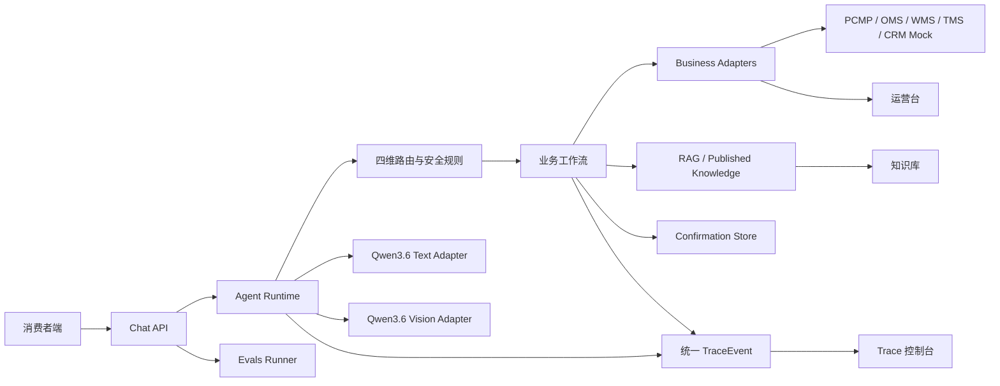

# 客服 Agent 实验室

一个可本地运行、可追溯、可评测的灯具售后客服 Agent Sandbox。项目已完成 P0：消费者对话、业务工具、知识库与 RAG、统一写操作确认、统一 Trace、运营台和固定 Evals 均已接通；真实文字与图片模型 Smoke Test 已通过，企业业务系统仍由 Mock Adapter 模拟。

## 当前状态

| 项目 | 当前结果 |
| --- | --- |
| 产品范围 | P0 功能与作品集收口完成 |
| 公共契约 | `1.1.0` |
| 模型 | `Qwen3.6-27B`，文字与图片理解统一网关，逻辑 Adapter 隔离 |
| 业务数据 | PCMP / OMS / WMS / TMS / CRM Mock Adapter |
| 知识 | 本地工作副本 + 已发布快照 + 确定性 RAG |
| 自动化门禁 | 37 个测试文件，256/256 测试与 Next.js 生产构建通过 |
| 固定 Evals | 36/36，100% |
| Live 验收 | 文字 Smoke、图片 Smoke、6/6 Live 模型 + Mock 业务 E2E 通过 |

## 一条命令启动

需要 Node.js 20+ 与 pnpm。在项目根目录运行：

```bash
pnpm --dir 03-开发/应用工程 install && pnpm --dir 03-开发/应用工程 dev
```

打开 `http://localhost:3000`。默认是 Mock 模式，不需要模型凭据；全量检查使用：

```bash
pnpm --dir 03-开发/应用工程 check
```

## 五个页面

| 页面 | 路径 | 作用 |
| --- | --- | --- |
| 消费者端 | `/` | 文字/图片对话、进度、确认卡、停止与重试、反馈 |
| 知识库 | `/knowledge` | 新建、编辑、预览、发布、停用和版本隔离 |
| 运营台 | `/ops` | 查看订单变更、催办、退换、工单、人工接管和风险会话 |
| Trace 控制台 | `/trace` | 按 Trace、会话、时间、事件、状态追溯完整执行链 |
| Evals | `/evals` | 运行 36 项固定案例，查看 Grader、失败阶段与 Trace |

消费者首页只展示三个公开快捷入口：

1. 查订单物流：订单状态、履约、物流、催办、地址修改与取消申请。
2. 退换与破损：图片观察、退换草稿、确认提交与进度查询。
3. 故障报修：安全规则、知识排查、维修或安装工单。

产品知识、配网、安装指导、质保与渠道咨询由后台隐藏知识路由承接，不增加第四个消费者入口。`02-原型` 中曾出现四个快捷入口的 HTML 是早期交互探索，仅作历史参考，不是当前产品或验收依据。

## Mock 与 Live 模式

- Mock：默认模式；模型、业务系统和知识数据都可离线演示，固定 Evals 可重复运行。
- Live：只允许本机服务从 `03-开发/应用工程/.env.local` 读取模型配置；该文件已忽略，禁止提交、截图、Trace 或报告记录凭据。
- 统一模型：`UNIFIED_MODEL_MODE=true` 时，文字路由、低风险回答和图片理解都使用 `Qwen3.6-27B` 的 OpenAI Chat Completions 兼容网关；Text / Multimodal Adapter 仍保留独立接口，避免模型协议侵入业务层。
- 业务边界：Live 模式也不连接真实 PCMP / OMS / WMS / TMS / CRM，业务执行始终通过 Mock Adapter。

当前客服 VLM 契约只观察用户上传图片并返回结构化可见信息。图片生成、局部重绘或编辑接口不属于当前客服 VLM 契约，也不参与 P0 验收。

## 架构



同一消费者请求只有一个 `traceId`。模型、路由、风险规则、RAG、工具、确认、输出、错误和 fallback 都写入统一 `TraceEvent`；消费者 `AgentEvent` 与 `ChatResponse` 不携带后台调试对象。Trace 不保存图片 Data URL、图片原始编码、Authorization、凭据、未脱敏手机号/地址或模型私有思维链。

## 目标系统映射

| 目标系统 | 正式职责 | 当前实现 |
| --- | --- | --- |
| PCMP | 产品型号、结构化参数、适配关系 | Mock Product Adapter |
| OMS / 商城 | 订单、订单状态、地址修改/取消资格 | Mock Order Adapter |
| WMS | 出库、履约节点 | Mock Fulfillment Adapter |
| TMS / 承运商 | 物流轨迹、配送异常、催办 | Mock Logistics Adapter |
| CRM / 客服系统 | 退换、维修/安装工单、人工接管 | Mock Service Adapter |
| 客服知识库 | FAQ、安装、质保、渠道与安全知识 | Local Knowledge Adapter |

上层运行时和工作流只依赖统一接口；替换 Adapter 时，不改消费者事件、确认协议、安全规则或 Trace 契约。

## RAG 与确认协议

RAG 只检索已发布、未过期且适用范围匹配的知识，返回候选分数、过滤原因、采用条目、版本和引用。无命中时不编造；内容冲突时不自动选边；产品结构化参数以 PCMP 结果为准。

物流催办、订单地址修改、取消订单、退换申请、维修工单和安装工单统一使用正式确认协议：服务端生成 `confirmationRequestId`、`confirmationToken`、`idempotencyKey`、过期时间与草稿快照；消费者只能原样回传并选择 confirm / modify / cancel，不能自行构造 operation。写工具只在校验成功且未收到停止信号后执行，幂等键防止重复写入。安全自动升级不走普通确认卡。

## Evals 与交付证据

固定数据集版本为 `evals-v1.0.0`，Mock 版本为 `mock-orchestrator-v1`。36 项覆盖权限、工具成功/失败、正常意图、图片、RAG、无知识、知识冲突、安全/人工、Prompt Injection 与闲聊/兜底；route、risk、tool、confirmation、source、response boundary 六个确定性 Grader 全部通过。

| 模块 | 最终专项证据 |
| --- | --- |
| 01 Runtime | 9 个测试文件，92/92；文字/图片 Live Smoke、fallback、Abort 与 Trace 脱敏 |
| 02 Business | 5 个测试文件，49/49；确认、幂等、异常注入与新增 P0 业务记录 |
| 03 Knowledge | 3 个测试文件，12/12；published-only、无命中、冲突、过期、版本与 reset |
| 04 Consumer | 6 个测试文件，36/36；图片状态、停止恢复、确认防双击与 debug 隔离 |
| 05 Operations | 2 个测试文件，10/10；记录查询、详情、Trace 关联与统一 reset |
| 06 Evals | 36/36，100%；每例均关联唯一 Trace，失败不中断后续案例 |

详细结果见 [阶段 5 集成报告](03-开发/并行开发/集成报告/2026-09-01-stage5-live-e2e.md)、[最终评测报告](03-开发/并行开发/集成报告/2026-09-02-stage6-final.md) 和 [作品集说明](03-开发/作品集/README.md)。

## 作品集预览

| 消费者端 | 知识库 |
| --- | --- |
|  |  |

| 运营台 | Trace | Evals |
| --- | --- | --- |
|  |  |  |

## 已知限制

- 所有 Session、Trace、Feedback、Evals、知识和业务 Store 都是本地内存实现，进程重启后恢复种子数据；Sandbox reset 会清理运行态记录。
- 未实现登录、RBAC、审计归档、生产级加密、限流、并发隔离或多租户。
- 未连接真实 PCMP / OMS / WMS / TMS / CRM，也未验证企业字段、权限、错误码与 SLA。
- RAG 是确定性本地检索，不是生产向量数据库；知识审核流、批量导入、回滚和权限仍属后续范围。
- Live 模型体验依赖本机网关的可用性、配额与时延，不作为确定性回归门禁。
- 图片理解仅用于可见信息观察，不能自动判责、鉴真、确定退换资格或赔偿。
- 演示身份、订单和联系方式均为虚拟/脱敏数据；项目尚未完成生产隐私、安全与合规评审。

## 文档导航

- [PRD](01-需求/客服Agent实验室-PRD.md)
- [意图路由表](01-需求/客服Agent实验室-意图路由表.md)
- [模型接口与本地运行方案](01-需求/客服Agent实验室-模型接口与本地运行方案.md)
- [03-开发目录说明](03-开发/README.md)
- [并行开发与模块所有权](03-开发/并行开发/README.md)
- [作品集与演示脚本](03-开发/作品集/README.md)
